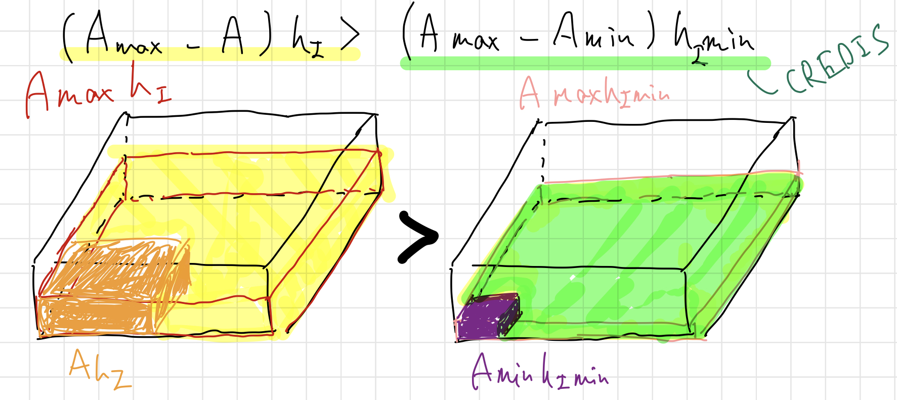

# Lake

Lake is treated in MATSIRO (lakesf.F, lakeic.F, and lakepo.F), as well as land.

Up to and including the calculation of the surface flux (section [11.1](##-Calculation-of-lake-surface-conditions) and [11.2](##-Solution-of-energy-balance-at-lake-surface)), the method is derived from the land surface model MATSIRO, while the calculation below the lake ice (section [11.3](##-Calculation-of-lake-ice) and [11.4]()) is derived from the ocean model COCO (COCO-OGCM). lakeic.F and lakepo.F were based on the COCO-OGCM, and the ENTRY statement are used so as to keep the structure of the original program. For practical use, note, for example, that the unit of temperature is $\mathrm{K}$ until flux calculation (section [11.1](##-calculation-of-lake-surface-conditions) and [11.2](##-Solution-of-energy-balance-at-lake-surface)), while it is $\mathrm{°C}$ after the ice and inter lake (section [11.3](##-Calculation-of-lake-ice) and [11.4]()). It is also noted that because the second half part is based on the old version of COCO, hence it is slightly different from the MIROC6-AOGCM and [Hasumi (2015)](https://ccsr.aori.u-tokyo.ac.jp/~hasumi/COCO/coco4.pdf).

Dimensions of the lake scheme is defined in `include/zkg21c.F`. `KLMAX` is the number of vertical layers set to 5 in MIROC6/MATSIRO6. `NLTDIM` is the number of tracers, 1:temperature 2:salt. Since the vertical layers are actually from `KLSTR=2` to `KLEND=KLMAX+1`, `NLZDIM = KLMAX+KLSTR` exists as a parameter for management.

Minimum depth of lake is given in `matdrv.F` as $10 \times 10^2 \mathrm{[cm]}$, hence any lakes cannot be disappeared even in severe conditions.

## Calculation of lake surface conditions

In `ENTRY[LAKEBC]` (in `SUBROUTINE:[LSFBCS]` of lakesf.F) lake surface albedo, roughness, and heat flux are calculated. They are calculated supposing ice-free conditions, then modified. While the albedo of snow is a pronostic variable, the lake surface albedo considering with ice and snow above is a diagnostic variable. The aging effect of the snow is  differently treated. These methods are acutally same with an old version of COCO-OGCM. The newst version of COCO, which is going to be coupled to MIROC7-AOGCM, has been applied a melt pond scheme a snow aging scheme which is basically the same with the treatment in the current land surface (Komuro, the GCM meeting on 22nd Feb, 2021).

<!--
- Prognostic variables

None.
-->
<!--
- Output data

| Variable                        | Variable in source code | Description                | Units                |
|:--------------------------------|:------------------------|:---------------------------|:---------------------|
| $α_{Lk}$                        | GRALB                   | Lake surface albedo        | $\mathrm{[-]}$       |
| $z_{Lk0}$                       | GRZ0                    | Lake surface roughness     | $\mathrm{[m]}$       |
| $G$                             | FOGFLX                  | Heat flux                  | $\mathrm{[W/m^2]}$   |
| $\frac{\partial G}{\partial T}$ | DFGT                    | Heat diffusion coefficient | $\mathrm{[W/m^2/K]}$ |
|                                 |                         |                            |                      |
-->

<!--
- Input variables

| Description            | Variable            | Variable in source codes | dimension | unit                |
|:-----------------------|:--------------------|:-------------------------|:----------|:--------------------|
| surface temprature     | $T_s$               | GRTS                     | IJLSDM    | $\mathrm{[K]}$      |
| ice base temperature   | $T_b$               | GRTB                     | IJLSDM    | $\mathrm{[K]}$      |
| lake ice amount        | $Ic$                | GRICE                    | IJLSDM    | $\mathrm{[kg/m^2]}$ |
| snow amount            | $Sn$                | GRSNW                    | IJLSDM    | $\mathrm{[kg/m^2]}$ |
| lake ice concentration | $R_{IcLk}$          | GRICR                    | IJLSDM    | $\mathrm{[-]}$      |
| u surface wind         | $u_a$               | GDUA                     | IJLSDM    | $\mathrm{[m/s]}$    |
| v surface wind         | $v_a$               | GDVA                     | IJLSDM    | $\mathrm{[m/s]}$    |
| cos(solar zenith)      | $\mathrm{cos}\zeta$ | RCOSZ                    | IJLSDM    | $\mathrm{[-]}$      |
-->

<!--
  - Internal parameters

| Description                   | Variable               | Variable in source codes | unit | Default value                                             |
|:------------------------------|:-----------------------|:-------------------------|:-----|:----------------------------------------------------------|
| diffusion coef. of snow       | DFSNOW                 | DFSNW                    | --   | $0.4$                                                     |
| maximum snow depth            |                        | SNWDMX                   | --   | $5.0$                                                     |
| minimum snow                  |                        | EPSSNW                   | --   | $1.0\times 10^{-8}$                                       |
| ice forming snow              |                        | SNWMAX                   | --   | $1000.0$                                                  |
| snow albedo                   | $\alpha_{SnLk(d,b)}$   | ABLSNW(2, NRBND)         | --   | $0.75, 0.5, 0.75, 0.5, 0.0, 0.0$                          |
| temperature for albedo change | $T_m^{min}, T_m^{max}$ | TALSNW(2)                | --   | $258.15, 273.15$                                          |
| roughness of snow             | $R_{SnLk}$             | Z0SNW(NTYZ0)             | --   | $1.0\times 10^{-2}, 1.0\times 10^{-3}, 1.0\times 10^{-3}$ |
| snow amount for fraction=1    |                        | SNWCRT                   | --   | $100.0$                                                   |
| snow density                  |                        | SNWDEN                   | --   | $400.0$                                                   |
| diffusion coef. of lake ice   | $Dv$                   | DFICE                    | --   | $2.00$                                                    |
| lake ice albedo               | $\alpha_{IcLk(b)}$     | ALBICE( NRBND )          | --   | $0.5, 0.5, 0.05$                                          |
| roughness of lake ice         | $R_{IcLk}$             | Z0ICE ( NTYZ0 )          | --   | $2.0\times 10^{-2}, 2.0\times 10^{-3}, 2.0\times 10^{-3}$ |
| ice amount for conc.=1        |                        | SICCRT                   | --   | $300.0$                                                   |
| lake ice density              |                        | SICDEN                   | --   | $1000.0$                                                  |
| heat z0/moumentum z0          |                        | Z0FCT                    | --   | $0.1$                                                     |
| minimum z0                    |                        | Z0MIN                    | --   | $.0\times 10^{-6}$                                        |
| depth of ML Ocean             |                        | DZOCN                    | --   | $50.0$                                                    |
| ocean dG/dTs                  |                        | DFOCN                    | --   | $1.0\times 10^{10}$                                       |
| LW albedo (1-emis)            |                        | ALBLO                    | --   | $5.0\times 10^{-2}$                                       |
-->

First, let us consider the lake albedo. The lake level $\alpha_{Lk(d,b)}$, $b=1,2,3$ represent the visible, near-infrared, and infrared wavelength bands, respectively. Also, $d=1,2$ represents direct and scattered light, respectively. The albedo for the visible bands are calculated in `SUBROUTINE:[LAKEALB]`, supposing ice-free conditions. The albedo for near-infrared is set to same as the visible one. The albedo for infrared is uniformly set to a constant value.

When lake ice is present, the albedo is modified to take into account the ice concentration.

$$
	{\alpha_{Lk}'} = \alpha_{Lk} + (\alpha_{IcLk}-\alpha_{Lk}) R_{IcLk}
$$

where $\alpha_{IcLk}$ is the lake ice albedo, and $R_{IcLk}$ is the lake ice concentation, respectively. In addition, we want to consider the albedo change due to snow cover. Assuming that the snow albedo depends on the skin temperature, we can calculate a function $F$ below.

$$
	F(T_s) = \frac{T_s-T_m^{min}}{T_m^{max}-T_m^{min}} \quad,\quad (0 \le F(T_s)\le 1)
$$

where $T_s$ is the skin temperature, and $T_m^{min}$ and $T_m^{max}$ are the minimum and the minimum temperature for the albedo change, respectively.

Then, the albedo can be modified by

$$
	{\alpha_{Lk}''} = \alpha_{Lk(1,b)} + (\alpha_{SnLk(2,b)}-\alpha_{SnLk(1,b)})F(T_s)
$$

$$
	\alpha_{Lk} = {\alpha_{Lk}'} +(\alpha_{Lk}''-\alpha_{Lk}')R_{SnLk}
$$

where the $\alpha_{SnLk(d,b)}$ is the snow albedo covering the lake, and $R_{SnLk}$ is the snow coverage, respectively.

Second, let us consider the lake surface roughness. The roughnesses of for momentum, heat and vapor are calculated in `SUBROUTINE:[LAKEZ0F]`, based on [Miller et al. (1992)](https://www.sciencedirect.com/science/article/pii/S1359029497800489), same with COCO-OGCM ([Hasumi 2015](https://ccsr.aori.u-tokyo.ac.jp/~hasumi/COCO/coco4.pdf)), supposing the ice-free conditions, then modified.

When lake ice is present, each roughness is modified to take into account the lake ice concentration ($R_{IcLk}$)

$$
	{z_{Lk0}'} = z_{Lk0} + (R_{IcLk} -z_{Lk0}) R_{IcLk}
$$

where $z_{Lk0}$ is surface roughness.

Then, taking into account the snow coverage ($R_{SnLk})$, we can express it as

$$
	{z_{Lk0}} = {z_{Lk0}'} + (R_{SnLk} - {z_{Lk0}'}) R_{SnLk}
$$

Third, the heat flux is considered with the temperature differences between the snow surface and the ice bottom, because the difference should be zero in the ice-free conditions.

If the lake ice exists, the heat diffusion coefficient is described as

$$
	\Big(\frac{\partial G}{\partial T}\Big) _{ IcLk }  = \frac{ D_{IcLk}}{R_{IcLk}}
$$

where $D_{IcLk}$ is the coefficient of lake ice.

If the snow exists, the heat diffusion coefficient of snow covered area is

$$
	\Big(\frac{\partial G}{\partial T}\Big)_{SnLk}  =  \frac{D_{IcLk}D_{SnLk}}{D_{IcLk}R_{SnLk}+D_{SnLk}R_{IcLk}}
$$

where $D_{SnLk}$ is the coefficient of snow.

Therefore, the net heat diffusion coefficient is finally
$$
	\frac{\partial G}{\partial T} = \Big(\frac{\partial G}{\partial T} \Big)_{IcLk} (1-R_{SnLk}) + \Big(\frac{\partial G}{\partial T}\Big)_{SnLk} R_{SnLk}
$$

The temperature differences between the snow surface ($T_S$) and the ice bottom ($T_B$) is saved as heat flux($G$).

$$
	G = \frac{\partial G}{\partial T} (T_B-T_S)
$$

###  Calculation of lake surface albedo

<!--
- Prognostic variables

None
-->
<!--
- Input variables

| Description         | Variable            | Variable | unit           |
|:--------------------|:--------------------|:---------|:---------------|
| $\mathrm{cos}\zeta$ | $\mathrm{cos}\zeta$ | COSZ     | $\mathrm{[-]}$ |

- Output variables

| Description                           | Variable           | Variable | unit           |
|:--------------------------------------|:-------------------|:---------|:---------------|
| lake surface albedo (direct, diffuse) | $\alpha_{Lk,L(d)}$ | GALB     | $\mathrm{[-]}$ |
-->

Contents of `SUBROUTINE:[LAKEALB]` is the same with `SUBROUTINE [SEAALB]` (in p-sfc.md). For lake surface level albedo $\alpha_{Lk,L(d)}$, $d=1,2$ represents direct and scattered light, respectively.

Using the solar zenith angle at latitude $\zeta$ ($\mathrm{cos}\zeta$), the albedo for direct light is presented by

$$
	\alpha_{Lk,L(1)} = e^{(C_3A^* + C_2) A^* +C_1}
$$

where $A = \mathrm{min}(\mathrm{max}(\mathrm{cos}\zeta,0.03459),0.961)$, and $C_1, C_2, C_3$ is $-0.7479, -4.677039, 1.583171$ respectively.

On the other hand, the albedo for scattered light is uniformly set to a constant parameter.

$$
	\alpha_{Lk,L(2)} = 0.06
$$

### Lake surface roughness

Contents of `SUBROUTINE:[LAKEZ0F]` is the same with `SUBROUTINE:[SEAZ0F]` (of pgocn.F).

<!--
- Prognostic variables

None
-->
<!--
- Output variables

| Description                    | Variable    | Variable | dimension | unit           |
|:-------------------------------|:------------|:---------|:----------|:---------------|
| surface roughness for momentum | $z_{Lk0,M}$ | GRZ0M    | IJLSDM    | $\mathrm{[m]}$ |
| surface roughness for heat     | $z_{Lk0,H}$ | GRZ0H    | IJLSDM    | $\mathrm{[m]}$ |
| surface roughness for vapor    | $z_{Lk0,E}$ | GRZ0E    | IJLSDIM   | $\mathrm{[m]}$ |

- Input variables

| Description                               | Variable | Variable | dimension | unit             |
|:------------------------------------------|:---------|:---------|:----------|:-----------------|
| u wind of the 1st layer of the atmosphere | $u_a$    | GDUA     | IJLSDM    | $\mathrm{[m/s]}$ |
| v wind of the 1st layer of the atmosphere | $v_a$    | GDVA     | IJLSDM    | $\mathrm{[m/s]}$ |
-->

The roughness variation of the lake surface is determined by the friction velocity $u^\star$.

$$
u^{\star} = \sqrt{C_{M_0} ({u_a}^2  +{v_a}^2)}
$$

We perform successive approximation calculation of ${C_{M_0}}$, because $F_u,F_v,F_\theta,F_q$ are required.

$$
	z_{Lk0,M} = z_{0,M_0} + z_{0,M_R} + \frac{z_{0,M_R} {u^\star }^2 }{g} + \frac{z_{0,M_S}\nu }{u^\star}
$$

$$
	z_{Lk0,H} = z_{0,H_0} + z_{0,H_R} + \frac{z_{0,H_R} {u^\star }^2 }{g} + \frac{z_{0,H_S}\nu }{u^\star}
$$

$$
	z_{Lk0,E} = z_{0,E_0} + z_{0,E_R} + \frac{z_{0,E_R} {u^\star }^2 }{g} + \frac{z_{0,E_S}\nu }{u^\star}
$$

where, $\nu = 1.5 \times 10^{-5} \mathrm{[m^2/s]}$ is the kinetic viscosity of the atmosphere, $z_{0,M},z_{0,H}$ and $z_{0,E}$ are surface roughness for momentum, heat and vapor, and
$z_{0,M_0},z_{0,H_0}$ and $z_{0,E_0}$ are base of them, and $z_{0,M_R},z_{0,M_R}$ and $z_{0,E_R}$ are rough factor for them, and $z_{0,M_S},z_{0,M_S}$ and $z_{0,E_S}$ are smooth factor for them, respectively.

## Solution of energy balance at lake surface

In `SUBROUTINE:[LAKEHB]` (of lakesf.F), the energy balance at lake surface is solved.

<!--
- Prognostic variables

None
-->
<!--
- Output variables

| Description        | Variable       | Variable | dimension | unit |
|:-------------------|:---------------|:---------|:----------|:-----|
| surface water flux | $W_{free/ice}$ | WFLUXS   | IJLSDM,2  | --   |
| upward long wave   | $LW^\uparrow$  | RFLXLU   | IJLSDM    | --   |
| flux balance       | $F$            | SFLXBL   | IJLSDM    | --   |

- Input variables

| Description                   | Variable                          | Variable |
|:------------------------------|:----------------------------------|:---------|
| sensible heat flux coefficent | $\frac{\partial H}{\partial T_s}$ | DTFDS    |
| latent heat flux coefficient  | $\frac{\partial E}{\partial T_s}$ | DQFDS    |
| surface heat flux coefficient | $\frac{\partial G}{\partial T_s}$ | DGFDS    |
| downward SW radiation         | $SW^\downarrow$                   | RFLXSD   |
| upward SW radiation           | $SW^\uparrow$                     | RFLXLU   |
| downward LW radiation         | $LW^\downarrow$                   | RFLXLD   |
| lake surface albedo           | $\alpha_{Lk}$                     | GRALBL   |
| lake ice concentration        | $R_{IcLk}$                        | GRICR    |

*The comments for some variables say "soil", but this is because the program was adapted from a land surface scheme, and has no particular meaning.*
-->

Downward radiative fluxes are not directly dependent on the condition of the lake surface, and their observed values are simply specified to drive the model. Shotwave emission from the lake surface is negligible, so the upward part of the shortwave radiative flux is accounted for solely by reflection of the incoming downward flux. Let $\alpha_{Lk,SW}$ be the lake surface albedo for shortwave radiation. The upward shortwave radiative flux ($SW^\uparrow$) is represented by

$$
	SW^\uparrow = - \alpha_{Lk,SW} SW^\downarrow
$$

where $SW^\downarrow$ is the downward shortwave radiation flux, and $\alpha_{Lk,SW}$ is lake surface albedo for shortwave radiation in the ice-free area, respectively. On the other hand, the upward longwave radiative flux has both reflection of the incoming flux and emission from the lake surface. Let $\alpha_{Lk}$ be the lake surface albedo for longwave radiation and $\epsilon$ be emissivity of the lake surface relative to the black body radiation. The upward shortwave radiative flux is represented by

$$
	LW^\uparrow = - \alpha_{Lk} LW^\downarrow + \epsilon \sigma T_s ^4
$$

where $\sigma$ is the Stefan-Boltzmann constant, and $T_s$ is surface temprature, respectively. If lake ice exists, snow or lake ice temperature is considered by fractions. When radiative equilibrium is assumed, emissivity becomes identical to co-albedo:

$$
	\epsilon = 1 - \alpha_{Lk}
$$

The net surface flux is presented by

$$
	F^*=H + (1-\alpha_{Lk})\sigma T_s^4 + \alpha_{Lk} LW^\uparrow - LW^\downarrow +SW^\uparrow - SW^\downarrow		
$$

The heat flux into the lake surface is presented, with the surface heat flux ($G$) calculated in `SUBROUTINE:[SFCFLX]` (in matdrv.F).

$$
	G^* = G - F^*
$$

where $G^* $ is the net incoming flux (the opposite direction with $F^* $).

The temperature derivative term is

$$
	\frac{\partial G^*}{\partial T_s} = \frac{\partial G}{\partial T_s}+\frac{\partial H}{\partial T_s}+\frac{\partial R}{\partial T_s}
$$

When the lake ice exists, the sublimation flux ($l_sE$) is considered

$$
	G_{IcLk} = G^* - l_s E
$$

The temperature derivative term is

$$
	\frac{\partial G_{IcLk}}{\partial T_s}=\frac{\partial G^*}{\partial T_s} + l_s\frac{\partial E}{\partial T_s}
$$

Finally, we can update the skin temperature with the lake ice concentration with $\Delta T_s=G_{IcLk} ( \frac{\partial G_{IcLk}}{\partial T_s})^{-1}$

$$
	T_s = T_s +R_{IcLk} \Delta T_s
$$

Then, the sensible heat flux ($E_{IcLk}$) and latent heat flux ($E_{IcLk}$) on the lake ice is updated.

$$
	E_{IcLk} = E + \frac{\partial E}{\partial T_s}\Delta T_s
$$

$$
	H_{IcLk} = H + \frac{\partial H}{\partial T_s}\Delta T_s
$$

When the lake ice does not existed, otherwise, the evaporation flux ($l_cE$)is added to the net flux.

$$
	G_{freeLk}=F^* + l_cE
$$

Finally each flux is updated.

For the sensible heat flux ($H$), the temperature change on the lake ice is considered.

$$
	H=H+ R_{IcLk}  H_{IcLk}
$$

where $H_{IcLk}$ is the sensible heat flux on the lake ice. Then, the heat used for the temperature change is saved as:

$$
	F = R_{IcLk} H_{IcLk}
$$

For the upward longwave radiative flux ($LW^\uparrow$), the temperature change on the lake ice is considered.

$$
	LW^\uparrow=LW^\uparrow +  4\frac{\sigma}{T_s}R_{IcLk}  \Delta T_s
$$

For the surface heat flux, the lake ice concentration is considered.

$$
	G=(1-R_{IcLk})G_{freeLk} + R_{IcLk}G_{IcLk}
$$

For the latent heat flux, the lake ice  concentration is considered.

$$
	E=(1-R_{IcLk})E + R_{IcLk}E_{IcLk}
$$

Each term above are saved as freshwater flux.

$$
	W_{freeLk} = (1-R_{IcLk}) E
$$

$$
	W_{IcLk} = R_{IcLk} E_{IcLk}
$$

## Calculation of lake ice

In this section, the lake ice calculation is described. There are three prognostic variables in the lake ice model described herein: lake ice concentration $A_I$, which is area fraction of a grid covered by lake ice and takes a value between zero and unity; mean lake ice thickness $h_I$ over ice-covered part of a grid; mean snow depth $h_S$ over lake ice. Horizontal flow of ice is not considered in the lake parts, differently from the COCO-OGCM. Let us consider here a case that the model is integrated from the n-th time level to the (n+1)-th time level. $A_I$, $h_I$ and $h_S$ are incrementally modified.

The model also calculates temperature at snow top (lake ice top when there is no snow cover) $T_I$, which is a diagnostic variable. Density of lake ice ($\rho_I$) and snow $(\rho_S)$ are assumed to be constant Lake ice is assumed to have nonzero salinity, and its value $S_I$ is assumed to be a constant parameter.

### Calculation of heat flux and growth rate

In `ENTRY:[FIHEATL]` (in `SUBROUTINE:[FIHSTL]` of lakeic.F), heat flux in lake ice and its growth rate is calculated.

<!--
- Pronostic variables

None
-->
<!--
- Input variables

| Description                                                                                        | Variable   | Variable in source code | unit                                    |
|:---------------------------------------------------------------------------------------------------|:-----------|:------------------------|:----------------------------------------|
| lake ice concentration                                                                             | $A_I$      | A                       | $\mathrm{[-]}$                          |
| air-ice heat flux multiplied by the factor of lake ice concentration                               | $Q_{AI}$   | QAI                     | $\mathrm{[-]}$                          |
| vertical heat flux through lake ice and snow                                                       | $Q_{IO}$   | QIO                     | $\mathrm{[W/m^2]}$                      |
| Shortwave radiation absorbed at ice-free lake surface, with the factor of ice-free area multiplied | $SW^A$     | SWABS                   | $\mathrm{[W/m^2]}$                      |
| Lake temperature  / Salinity                                                                       | $T, S$     | T(NLTDIM)               | $\mathrm{[^o C/m^2]}$/ $\mathrm{[psu]}$ |
| time step                                                                                          | $\Delta t$ | TS                      | $\mathrm{[s]}$                          |

- Output variables

| Description                            | Variable | Variable in source code | unit              |
|:---------------------------------------|:---------|:------------------------|:------------------|
| Lake ice growth rate in ice-free area  | $W_{AO}$ | WAO                     | $\mathrm{[cm/s]}$ |
| snow growth rate due to heat inbalance | $W_{AS}$ | WAS                     | $\mathrm{[cm/s]}$ |
| basal growth rate of lake ice          | $W_{IO}$ | WIO                     | $\mathrm{[cm/s]}$ |

- Internal works

| Description               | Variable   | Variable in source code | unit                   |
|:--------------------------|:-----------|:------------------------|:-----------------------|
| freezing point depression | $\Delta T$ | TDEV                    | $\mathrm{[^o C]}$      |
| lake ice growth rate      | $W_{FZ}$   | WFRZ                    | $\mathrm{[cm e.w./s]}$ |
-->

<!--
- parameters

| Description                                               | Variable                        | Variable | unit                  | value                        |
|:----------------------------------------------------------|:--------------------------------|:---------|:----------------------|:-----------------------------|
| coeficient for a decreasing function of salinity          | $\frac{\partial T}{\partial S}$ | dtds     | --                    | $-0.0543$                    |
| density of lake water                                     | $\rho_O$                        | rhoo     | $\mathrm{g/cm^3}$     | $1.0$                        |
| latent heat cofefficient to melt                          | --                              | emeltl   | $\mathrm{J/kg}$       | $3.4 \times 10^5$            |
| latent heat fusion \*3                                    | $L_f$                           | hfus     | $\mathrm{erg/g}$      | $E_l \times 1.0 \times 10^4$ |
| --                                                        | $\frac{1}{\rho_O L_f}$          | rrhfus   | $\mathrm{cm^3/erg}$   | $1.0 /\rho_I/L_f$            |
| fraction of $SW^A$ absorbed by the lake model's top level | $I(z=2)$                        | SWCNV1   | $\mathrm{ND}$         |                              |
| heat capacity of lake water                               | $C_{po}$                        | cpo      | $\mathrm{erg/g/^o C}$ | $3.990\times 10^7$           |
| thickness of the lake model's top level                   | $D_1$                           | DZ1      | $\mathrm{cm}$         | $1.0\times 10^2$             |

*3 same value is applied to snow and lake ice.

-->

Temperature at lake ice base is taken to be the lake model’s top level temperature $T(k=2)$. In this model, lake ice exists only when and where $T(k=2)$ is at the freezing point $T_f$, which is a decreasing function of salinity ($T_f= −0.0543 S$ is used here, where temperature and salinity are measured by ◦C and psu, respectively). In heat budget calculation for snow and lake ice, only latent heat of fusion and sublimation is taken into account, and heat content associated with temperature is neglected. Therefore, temperature inside lake ice and snow are not calculated, and $T_I$ is estimated from surface heat balance.

Nonzero minimum values are prescribed for $A_I$ and $h_I$ , which are denoted by $A^{min}_I$ and $h^{min}_I$, respectively. These parameters define a minimum possible volume of lake ice in a grid. If a predicted volume $A_Ih_I$ is less than that minimum, $A_I$ is reset to zero, and $T_1$ is lowered to compensate the corresponding latent heat. In this case, the lake model’s top level is kept at a supercooled state. Such a state continues until the lake is further cooled and the temperature becomes low enough to produce more lake ice than that minimum by releasing the latent heat corresponding to the supercooling.

Surface heat flux is separately calculated for each of air-lake and air-ice interfaces in one grid.

The skin temperature of lake ice $T_I$ is determined such That

$$
	Q_{AI} = Q_{IO}
$$

is satisified, where $Q_{IO}$ is corresponding to $G+SW^\downarrow$ and $Q_{AI}$ is corresponding to $G_{IcLk} - W_{IcLk}$. However, When the estimated $T_I$ exceeds the melting point of lake ice $T_m$ (which is set to 0 ◦C for convenience), $T_I$ is reset to $T_m$ and $Q_{AI}$ and $Q_{IO}$ are re-estimated by using it. The heat inbalance between $Q_{AI}$ and $Q_{IO}$ is consumed to melt snow (lake ice when there is no snow cover). Snow growth rate due to this heat imbalance is estimated by

$$
	W_{AS} = \frac{Q_{AI}-Q_{IO}}{\rho L_f}
$$

where $\rho_O$ is density of lakewater and $L_f$ is the latent heat of fusion (the same value is applied to snow and lake ice). This growth rate is expressed as a change of equivalent liquid water depth per time.  It is zero when $T_I < T_m$ and negative when $T_I = T_m$. Note that $W_{AS}$ is weighted by lake ice concentration.

Although it is assumed that $T(2) = T_f$ when lake ice exists, $T_1$ could deviated from $T_f$ due to a change of salinity or other factors. Such deviation should be adjusted by forming or melting lake ice. Under a temperature deviation of the top layer of lake,

$$
	\Delta T = T(k=2) - T_f S(k=2)
$$

lake ice growth rate necessary to compensate it in the single time step is given by

$$
	W_{FZ} = - \frac{C_{po} \Delta T \Delta z_1}{L_f \Delta t}
$$

where $C_{po}$ is the heat capacity of lake water and $\Delta z_1=100 \mathrm{cm}$ is the thickenss of the lake model's top level (uniformly set to constant in case of the current lake model.) This growth rate is estimated at all grids, irrespective of lake ice existence, for a technical reason. As described below, this growth rate first estimates negative ice volume for ice-free grids, but the same heat flux calculation procedure as for ice-covered grids finally results in the correct heat flux to force the lake. Basal growth rate of lake ice is given by

$$
	W_{IO} = A_I W_{FZ} + \frac{Q_{IO}}{\rho_OL_f}
$$

where, again, $W_{IO}$ is weighted by lake ice concentration.

Lake ice formation could also occur in the ice-free area. Let us define $Q_{AO}$ by

$$
	Q_{AO} = (1-A_{I}) [Q-(1-\alpha_{Lk,SW})SW^\downarrow]
$$

i.e., air-lake heat flux except for shortwave, multiplied by the factor of the fraction of ice-free area. Here, $Q$ is  air-ice heat flux. Shortwave radiation absorbed at ice-free lake surface, with the factor of ice-free area multiplied, is represented by

$$
	SW^A = (1-A_I)(1-\alpha_{Lk,SW}) SW^\downarrow
$$

Lake ice growth rate in ice-free area is calculated by

$$
	W_{AO} = (1-A_I)W_{FZ} + \frac{Q_{AO}+I(k=2) SW^A}{\rho_O L_f}
$$

where $I(k=2)$ denotes the fraction of $SW^A$ absorbed by the lake model's top level, which is calculate in `SUBROUTINE:[SVTSETL]` of lakepo.F.

Finaly, the heat flux for freshwater is

$$
	G_{lake} = \Delta z_1 \frac{\Delta T }{\Delta t}
$$

### Sublimation and freshwater flux for lake

In `ENTRY[FWATERL]` (in `SUBROUTINE:[FWASTL]` of lakeic.F), sublimation (freshwater) flux, which is practically come from the land ice runoff, is calculated or prescribed over lake ice cover.

<!--
- Input variables

| Description                     | Variable   | Variable | dimension | unit            |
|:--------------------------------|:-----------|:---------|:----------|:----------------|
| latent heat flux of evaporation | $F_W^{EV}$ | WEV      | --        | $\mathrm{cm/s}$ |
| latent heat flux of sublimation | $F_W^{SB}$ | WSB      | IJLDIM    | $\mathrm{cm/s}$ |
| overflow snow flux              | $S_{off}$  | SOFF     | --        | $\mathrm{cm/s}$ |

- Prognostic variables (output variables)

| Description        | Variable | Variable | dimension | unit            |
|:-------------------|:---------|:---------|:----------|:----------------|
| lake ice fraction  | $A_I'$   | AX       | IJLDIM    | $\mathrm{[-]}$  |
| lake ice thickenss | $h_I'$   | HIX      | IJLDIM    | $\mathrm{[cm]}$ |
| Snow depth         | $h_S'$   | HSX      | IJLDIM    | $\mathrm{[cm]}$ |
-->
<!--
- parameters

| Description                   | Variable     | Variable | unit              | value            |
|:------------------------------|:-------------|:---------|:------------------|:-----------------|
| density of snow               | $\rho_S$     | rhos     | $\mathrm{g/cm^3}$ | $0.33$           |
| density of lake ice           | $\rho_I$     | rhoi     | $\mathrm{g/cm^3}$ | $0.9$            |
| Ratio of density (ocean/snow) | $R_{\rho_S}$ | rrs      | $\mathrm{[-]}$    | $\rho_O/\rho_s$  |
| Ratio of density (ocean/ice)  | $R_{\rho_I}$ | rri      | $\mathrm{[-]}$    | $\rho_O/\rho_I$  |
| Minimum thickness of ice      | $h_I^{min}$  | himin    | --                | $1.0\times 10^1$ |
-->

The flux is first consumed to reduce snow thickness in n-th timstep:

$$
	h_S' = h_S^n -  \frac{\rho_O  F_W^{SB}\Delta t}{\rho_S A_I^n}
$$

If $h_S'$ becomes less than zero, it is reset to zero.  Then, the melted snow flux is added to $F_W^{SB}$. $F_W^{SB}$ is redefined by

$$
	F_W^{SB}{'} = F_W^{SB} + \frac{\rho_S A_I^n (h_S' - h_S^n)}{\rho_O\Delta t}
$$

Where there no remains snow, but $F_W^{SB}{'}$ is not zero, The remain flux is consumed to reduce lake ice thickness:

$$
	h_I' = h_I^n - \frac{\rho_O F_W^{SB}{'} \Delta t }{\rho_I A_I^n}
$$

If $h_I'$ becomes less than $h_I^{min}$, it is reset to zero. Then,  the melted iceflux is added to $F_W^{SB}{'}$. $F_W^{SB}{'}$ is redefined by

$$
	F_W^{SB}{''} = F_W^{SB}{'} - A_I^n \frac{\rho_S (h_I^n-h_I')}{\rho_O\Delta t}
$$

Finaly, nonzero $F_W^{SB}{''}$ is consumed to reduce lake ice concentration:

$$
	A_I' = A_I^n - \frac{R_{\rho_I}F_W^{SB}{''} \Delta t }{h_I^{min}}
$$

if $A_I'$ becomes less then 0, it is reset to zero. Even if $A_I'$ becomes less than $A_I^{min}$, on the other hand, it is not adjusted here. If $A_I'$ is adjusted to zero, it means that the sublimation flux is not used up by eliminating snow and lake ice.

The remaining part is consumed to reduce lake water, so the evaporation flux $F_W^{EV}$ is modified as

$$
	F_W^{EV} = F_W^{EV} + F_W^{SB} + \frac{(A_I'-A_I^n) h_I^{min}}{R_{\rho_I}\Delta t}
$$

The later two terms cancel out if the adjustment does not take place.

If there is no lake ice, evaporation flux is just as

$$
	F_W^{EV}{'} = F_W^{EV} + F_W^{SB}
$$

The adjusted evaporation flux is saved

$$
	\Delta F_W^{EV} = F_W^{EV}{'}-	F_W^{EV}
$$

When sublimation flux is consumed to reduce lake ice amount, salt contained in lake ice has to be added to the remaining lake ice or the underlying water. Otherwise, total salt of the ice-lake system is not coserved. Here, it is added to underlying water, and the way of this adjustment is described later. Nothe that lake ice tends to gradually drain high salinity water contained in brine pockets in reality. Thus, such an adjustment is not very unreasonable. When $A_I'$ is adjusted to zero, on the other hand, the remaining sublimation flux is consumed to reduce lake water. In this case, difference between the latent heat of sublimation and evaporation has to be adjusted, which is also described later.

If the ice and/or snow is too thick, they are converted to snow flux. Here, the overflow snowflux $S_{off}$ is added to ${F_W^{SN}}$

$$
	F_W^{SN} = F_W^{SN} + S_{off}
$$

$S_{off}$ is actually calculated in `SUBROUTINE[MATDRV]` (of matdrv.F) and handed to `ENTRY:[FWATER]`.

### Updating lake ice fraction

<!--
- Input variables

| Description                       | Variable | Variable in source code | unit              |
|:----------------------------------|:---------|:------------------------|:------------------|
| Thickness of lake ice a           | $h_I$    | HIX                     | $\mathrm{[cm]}$   |
| snow growth rate in ice-free area | $W_{AO}$ | WAO                     | $\mathrm{[cm/s]}$ |
-->

In `ENTRY:[PCMPCTL]` (in `SUBROUTINE:[CMPSTL]` of lakeic.F), the lake ice fraction is updated, using the lake ice thickness ($h_I$) and the growth (retreat) rate in ice-free area ($W_{AO}$):

$$
	{A_I^{n+1}} = {A_I'} +\frac{\rho_O }{\rho_I h_I \phi W_{AO}\Delta t}
$$

If $A_I^{n+1}$ becomes greater than 1, it is reset to 1, and if $A_I^{n+1}$ becomes smaller than zero, it is reset to zero.

### Growth and Melting

In `ENTRY:[PTHICKL]` (in `SUBROUTINE:[OTHKSTL]` of lakeic.F), the lake ice growth and melting are calculated. The variables in the (n+1)-th time level are finally determined here.

<!--
- variables

| Description                                | Variable                | Variable | dimension      | unit |
|:-------------------------------------------|:------------------------|:---------|:---------------|:-----|
| lake ice fraction                          | $A_I^{n+1}$             | AX       | IJLDIM         | --   |
| lake ice volume                            | $V_I$                   | AXHIX    | IJLDIM         | --   |
| lake snow volume                           | $V_S, V_S', V_S^{**}$   | AXHSX    | IJLDIM         | --   |
| lake ice volume                            | $V_I^{n+1}$             | AXHIXN   | IJLDIM         | --   |
| --                                         | $V_S^{n+1}$             | AXHSXN   | IJLDIM         | --   |
| lake ice thickenss                         | $h_I'$                  | HIX      | IJLDIM         | --   |
| Snow depth                                 | $h_S'$                  | HSX      | IJLDIM         | --   |
| Snow depth                                 | $h_S^n$                 | HSZ      | IJLDIM         | --   |
| lake ice thickness                         | $h_I^n$                 | HIZ      | IJLDIM         | --   |
| snow growth rate due to heat inbalance     | $W_{AS}$                | WAS      | IJLDIM         | --   |
| lake ice growth rate due to heat inbalance | $W_{AI}$                | WAI      | IJLDIM         | --   |
| Reduced heat flux                          | $W_{res}$               | WRES     | IJLDIM         | --   |
| basal growth rate of lake ice              | $W_{IO}$                | WIO      | IJLDIM         | --   |
| snow fall flux                             | $F_W^{SN}, {F_W^{SN}}'$ | SNOW     | IJLDIM         | --   |
| Lake ice growth rate in ice-free area      | $W_{AO}$                | WAO      | IJLDIM         | --   |
| precipitation flux                         | $F_W^{PR}$              | PREC     | IJLDIM         | --   |
| latent heat flux of evaporation            | $L_e$                   | EVAP     | IJLDIM         | --   |
| latent heat flux of sublimation            | --                      | SUBI     | IJLDIM         | --   |
| Lake ice concentration                     | $A_I'$                  | AZ       | IJLDIM         | --   |
| --                                         | --                      | ROFF     | IJLDIM         | --   |
| --                                         | --                      | ADJLAT   | IJLDIM         | --   |
| lake heat flux                             | $H_{lake}$              | FT       | IJLDIM, NLTDIM | --   |
| --                                         | --                      | FS       | IJLDIM         | --   |
| time step                                  | $\Delta t$              | TS       |                | --   |
-->
<!--
- parameters

| Description                   | Variable    | Variable | unit              | value               |
|:------------------------------|:------------|:---------|:------------------|:--------------------|
| density of snow               | $\rho_S$    | rhos     | $\mathrm{g/cm^3}$ | $0.33$              |
| density of lake ice           | $\rho_I$    | rhoi     | $\mathrm{g/cm^3}$ | $0.9$               |
| Ratio of density (ocean/snow) | $R_{rho_I}$ | rrs      | $\mathrm{[-]}$    | $\rho_O/\rho_s$     |
| Ratio of density (ocean/ice)  | $R_{rho_I}$ | rri      | $\mathrm{[-]}$    | $\rho_O/\rho_I$     |
| Minimum thickness of ice      | $h_I^{min}$ | himin    | --                | $1.0\times 10^1$    |
|                               | --          | AMIN     | --                | $1.0\times 10^{-6}$ |
|                               | --          | AMAX     | --                | $1.0$               |
|                               | --          | SI       | --                | $0.0$               |
|                               | --          | SREF     | --                | $3.5\times 10^1$    |
|                               | --          | AIH      | --                | $2.0\times 10^8$    |
|                               | --          | AIHB     | --                | $2.0\times 10^2$    |
-->

The lake ice volume ($V_I'$) and snow volume ($V_S'$) before the snow and ice growth are presented by

$$
	V_I' = A_I' h_I^n
$$

$$
	V_S' = A_I' h_S^n
$$

From here, let us consider the contribution of snowfall and freshwater fluxes to the growth.

Changes of snow depth due to snow fall (freshwater) flux ($F_W^{SN}$) (expressed by negative values to be consistent with other freshwater flux components) is first taken into account. $F_W^{SN}$ is not weighted by lake ice concentration or ice-free area are fraction, as snowfall take place for both regions.

If the newly predicted (in `ENTRY:[PCMPCTL]`) lake ice concentration ($A_I^{n+1}$) is zero, the amount of snow existed before the growth is added to the snowfall flux.

$$
	{F_W^{SN}}' = F_W^{SN} + \frac{\rho_S V_S'}{\rho_O \Delta t}
$$

Snow depth and amount is set to zero:

$$
	h_S'=0, \quad V_S^{**} = 0
$$

Otherwise, snowfall accumulates over the ice covered region. Snow depth is modified by

$$
	h_S^* = \frac{V_S'}{A_I^{n+1}} + \frac{\rho_O F_W^{SN}\Delta t}{\rho_S}
$$

And the snow amount is also modified by

$$
	V_S^* = A_I^{n+1} h_S^*
$$

The snowfall flux is reduced by that amount:

$$
	{F_W^{SN}}' = (1-A_I^{n+1}) F_W^{SN}
$$

Then, the snowfall flux is put together with the precipitation flux.

$$
	F_W^{PR} = F_W^{PR} + {F_W^{SN}}'
$$

When the lake ice is not existed ($A_I^{n+1}=0$), the snow amount grown above is converted to ice. Growth rate of the lake ice is presented by:

$$
 W_{AI}^* =   \frac{\rho_O V_S^{*}}{\rho_S \Delta t}
$$

When the lake ice existed, if the snow growth rate
$$
	W_{AS}^* = W_{AS} +  \frac{\rho_O V_S^{*}}{\rho_S \Delta t}
$$

is positive, the energy is used for the snow growing. Otherwise, $W_{AS}^*$ is assumed to reduce the lake ice.

$$
	W_{AI}^* = W_{AS}^*
$$

and deficient flux is come from the snow amount changes.

$$
	W_{AS}^* = - \frac{\rho_O V_S^{*}}{\rho_S \Delta t}
$$

Then, the snow depth is modified with the accumulation.

$$
	h_S^{**} = \frac{V_S^{*}+ \rho_O W_{AS} \Delta t}{\rho_S {A_I^{n+1}}}
$$

if $h_S'$ is less than 0, it is reset to zero.

Freshwater flux for ice growth is also considered. When the lake ice is not existed, the flux is just handed to the lake surface.

$$
	W_{IO}^* = W_{IO} + W_{AI}^*
$$

When the lake ice exists ($A_I^{n+1}>0$), if the ice growth rate

$$
	W_{AI}^* = W_{AI} + \frac{V_I^{*}}{R_{\rho_I \Delta t}}
$$

is negative, the flux is handed to the lake surface.

$$
		W_{IO}^* = W_{IO} + W_{AI}^*
$$

and deficient flux is come from the lake amount changes.

$$
	W_{AI}^* = - \frac{V_I^{*}}{R_{\rho_I \Delta t}}
$$

The amount of the ice is then updated,

$$
	V_I^* = V_I' + \frac{\rho_O W_{AI}\Delta t}{\rho_I}
$$

Then, the snow amount in the new timestep (n+1) is,

$$
	V_S^{n+1} = A_I^{n+1} h_S^{**}
$$

For the ice amount,

$$
	V_I^{n+1} = V_I^* + \frac{\rho_O (W_{IO}+W_{AO})\Delta t}{\rho_I}
$$

If $V_I^{n+1}$ is equal or less than 0, lake ice fraction is set to zero (A_I^{n+1}=0)and its thickness is set to $h_I^{min}$. Otherwise,

$$
	h_I^{ *** } = \frac{V_I^{n+1}}{A^*}
$$

If $h_I^{*** }$ is smaller than $h_I^{min}$, it is set t0 $h_I^{min}$ and the lake ice concentration is adjusted.

$$
	A_I^{n+1} = \frac{V_I^{n+1}}{h_I^{min}}
$$

If the $A_I^{n+1}$ is less than $A_I^{min}$, it is set to 0. If the $A_I^{n+1}$ is larger than $A_I^{max}=1$, it is set to $A_I^{max}$.

Let us consider the case of the ice is very thick.  Here, the remained volume, which is not covered by ice is considered.

$$
	V_a^{free} = (A_{max}-A_{min})h_I^{min}
$$

$$
	V^{free} = (A_{max}-A_I^{n+1})h_I^{*** }
$$

If $V^{free}>V_a^{free}$, the ice thickness is increased, by adding $V^{free}$

<!--

-->

$$
	h_I^{*** } = V^{free} + \frac{A_I^{n+1} h_I^{m+1}}{A_I^{max}}
$$

The deficient water is come from the snow. The snow depth is now updated

$$
	h_S^{\ *** } = A_I^{n+1}\frac{h_S^{\ *** }}{A_{max}-\frac{V_a^{free}}{h_I^{\ *** }}}
$$

Finally, check if the snow is under water.

$$
	h_S^{n+1} = \mathrm{min}(h_S^{\ *** }, \frac{\rho_O-\rho_I}{\rho_S}h_I^{\ *** })
$$

and the ice thickness is also updated.

$$
	h_I^{n+1} = h_I^{\ *** } + \frac{\rho_S}{\rho_I} (h_S^{\ *** }-h_S^{n+1})
$$

The growth rate of the lake ice is

$$
	W_I^n = \frac{\rho_S A_I^{n+1}h_I^{n+1} - V_I'}{\rho_I \Delta t}
$$

$$
	W_I^{n+1} = \frac{\rho_S A_I^{n+1}h_I^{n+1} - V_I^{n+1}}{\rho_I \Delta t}
$$

The growth rate of the snow is

$$
	W_S^n =  \frac{\rho_S A_I^{n+1}h_S^{n+1} - V_S'}{\rho_S \Delta t}
$$

$$
	W_S^{n+1} =  \frac{\rho_S A_I^{n+1}h_S^{n+1} - V_S^{n+1}}{\rho_S \Delta t}
$$

The sublimation flux $F_S$ is

$$
	F_S = S_I(W_I-F_W^{SB}{''})
$$

The freshwater flux ($F_W(1)$) is

$$
	F_W(1) = - F_W(1) + \frac{L_f}{C_p} \Big(W_I^{n+1}+W_S^{n+1}-Sn + \Delta F_W^{EV}\Big)
$$

The salinity flux ($F_W(2)$) is

$$
	F_W(2) =F_W^{EV} - F_W^{PR} - R_{off} + W_S^n + W_I^n
$$
