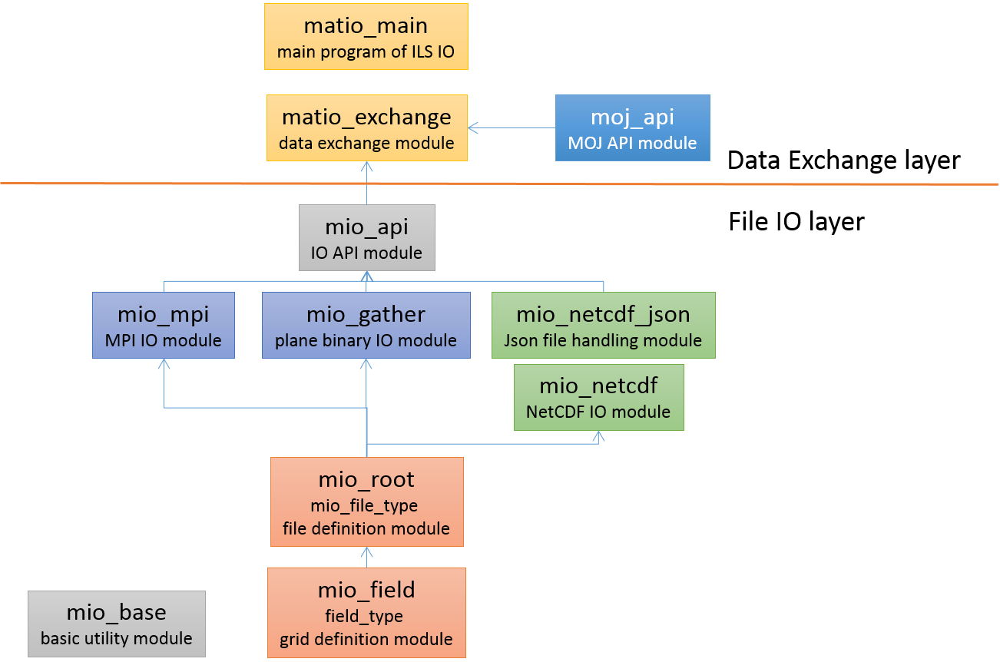

# Introduction


## Overview of ILS IO

As the name implies, an IO component ILS IO is a component that
substitutes for a file IO of other components construct ILS. ILS IO is
one component of ILS and excuts in parallel with other components. The
outline of functions are as follows;

1.  Read data from files and pass it to model components after grid
    remapping and time interpolation.

2.  Receive data from model components and output to file after grid
    remapping.

shows the overview of ILS IO.The external data at the left of the figure
is read into the IO and passed to the model component after grid
remapping and time interpolation. The data passed from the model
component is output to a file after grid remapping.

{#fig:IO_overview}

## Concept of ILS IO

The ILS IO is executed in parallel with other components and acts as an
IO for other components. As a result, the time required for the IO of
the model component can be reduced, and an improvement in overall
throughput can be expected. In addition, ILS IO not only simply performs
file input / output, but also has a grid conversion function and a time
interpolation function (when inputting). With these functions, it is
possible to input various external data without modifying the code of
each model component and output data of various grid systems and
resolutions as needed.

## Structure of ILS IO

The program structure of ILS IO is as shown in the .. The whole program
is composed of 11 modules represented by squares. These modules are
divided into two layers. The lower layer is a layer responsible for file
IO, and the upper layer is a layer responsible for data exchange. The
lower layer is further divided into four layers: a module that describes
the grid, a module that describes the file, a group of modules that
handle NetCDF IO and MPI IO, and a module that provides APIs.

The upper layer is composed of two parts, a \"matio_exchange\" module
that calls a subroutine of the ILS data exchange library MOJ and
exchanges data, and a main program \"matio_main\".

{#fig:Program_structure}

## Supported IO mode

There are three types of file I/O supported by ILS IO: MPI IO mode,
Gather mode, and NetCDF mode. In the MPI IO mode, each process uses the
MPI parallel input/output function and performs file input/output in
parallel. The Gather mode is a method in which data is gathered in a
root processor (gather), the root processor outputs a file, and the root
processor reads the file and distributes the data to each process
(scatter). In these modes, the file format is plain binary. In NetCDF
mode, as in Gather mode, data is collected in the root processor and a
file is output in NetCDF format. Currently, NetCDF mode only supports
file output.

# File

## File and data


ILS IO supports two file formats: plain binary (MPI IO mode and Gather
mode) and NetCDF (NetCDF mode, output only). One file includes one type
of data, and data at each time is arranged in chronological order. The
standard endian of the file is big endian. The byte length of the data
is single precision (4 bytes).

## Binary file format

The data at each time has a three-dimensional size of $(nx, ny, nz)$.
These value $(nx, ny, nz)$ are given in the configuration file described
later. Since the data is single precision, the record length of one
record is $nx * ny * nz * 4$. Endian is set by compile option when the
I/O mode is Gather mode. In MPI IO mode, the endian is checked inside
the program and conversion is performed if necessary.

## NetCDF file format

As in the case of the plain binary, the format of the netCDF dataset is
such that three-dimensional (nx, ny, nz) or two-dimensional (nx, ny)
data are arranged in time series. An example of the header of a NetCDF
dataset is shown in . In this example, two-dimensional data of
$nx = 720$ and $ny = 360$ are recorded in chronological order. Variable
attributes and global attributes are set in the Json style configuration
file described later.

``` {#list:netcdf_header caption="Header of NetCDF file" label="list:netcdf_header"}
netcdf ebflx {
dimensions:
        longitude = 720 ;
        latitude = 360 ;
        time = UNLIMITED ; // (48 currently)
variables:
        double longitude(longitude) ;
        double latitude(latitude) ;
        double time(time) ;
        float ebflx(time, latitude, longitude) ;
                ebflx:long_name = "Water Evaporation from Soil" ;
                ebflx:standard_name = "water_evaporation_flux_from_soil" ;
                ebflx:alma_name = "ESoil" ;
                ebflx:amip_name = "evspsblsoi" ;
                ebflx:units = "kg m-2 s-1" ;
                ebflx:type = "real" ;
                ebflx:positive = "up" ;
                ebflx:dimensions = "longitude latitude time" ;
                ebflx:comment = "Bare soil evaporation" ;

// global attributes:
                :title = "ILS output for GSWP3" ;
                :missing_value = "1e20" ;
                :int_missing_value = "-999" ;
                :contact = "Tomoko Nitta (t-nitta@iis.u-tokyo.ac.jp)" ;
                :institution = "Institute of Industrial Science, The University of Tokyo" ;
                :source = "ILS" ;
                :conventions = "CF-1.7 ALMA3" ;
                :history = "2019-05-30T18:20:00 Output from ILS" ;
}
```

# Configuration

## Configuration overview

The name of the configuration file is namelist.conf by default. In this
file, various settings related to the execution of ILS such as data
exchange, IO and Jcup setting are described. Here, the settings relating
to the IO will be particularly described. The three sections that
directly relate to the IO-related settings are the io_config section,
which specifies the operation of ILS IO, the nam_mio section, which
configures the grid system and input/output files, and the nam_netcdf
section, which configures the netCDF dataset. Furthermore, since the ILS
IO performs data exchange, it is necessary to set a nam_moj section that
performs settings related to data exchange. Therefore, these sections
will be described below.

## io_config
---------

\"io_config\" is a section that specifies the overall execution pattern
of the IO component. The setting example of io_config is shown in .

\"io_name\" is a name of ILS IO. Unless there is a specific reason,
users do not need to change the default name MATIO.

\"start_time\" and \"end_time\" represent the start and end times of
the model calculation in year/month/day/hour/minute/second.

\"data_intvl\" represents the default value of the recording time
interval of external data. The time interval can be set for each data by
the nam_mio section described later.

\"intvl_type\" represents the unit of data_intvl. Specify one of
\"MON\", \"DAY\", \"HUR\", \"MIN\", and \"SEC\".

\"io_mode\" sets the file I/O mode. Set any of \"MPI\", \"GATHER\", and
\"NETCDF\", and perform input/output in MPI IO mode, GATHER mode, and
NetCDF mode (output only; input is in GATHER mode).

\"calendar\" sets one of \"CALENDAR_NORMAL\", \"CALENDAR_NOLEAP\", and
\"CALENDAR_30360\" as the calendar system of the model. These correspond
to the regular Gregorian calendar, the yearly 365-day calendar with no
leap years, and the calendar of 30 days a month/360 days a year,
respectively.

\"write_file_extension\" sets the extension of write files.

``` {#list:io_config caption="Exanple of io\\_config section" label="list:io_config"}
&io_config
  io_name    = "MATIO",
  start_time = 2000,1,1,0,0,0
  end_time   = 2000,1,3,0,0,0
  data_intvl = 10800
  intvl_type = "SEC"
  io_mode = "NETCDF"
  calendar = "CALENDAR_NORMAL"
  write_file_extension = ".nc"
&end
```

## nam_mio

nam_mio section sets various settings relating to grid information,
initial data, input data, and output data.

The example of nam_mio grid setting is shown in . Here, \"io_grid\"
means grid name, and nx, ny, nz are grid size. A plurality of sets of
these values can be set. \"nz\" is the number of vertical layers of the
grid system, and the actual number of vertical layers of each data is
set in a nam_moj section described later.

``` {#list:nam_mio_grid caption="Example of nam\\_mio grid setting" label="list:nam_mio_grid"}
&nam_mio
  io_grid = "io_grid", nx = 720, ny = 360, nz = 6,
  io_grid = "cama_grid", nx = 360, ny = 180, nz = 1,
/
```

The example of nam_mio initial data setting is shown in .
\"init_data_dir\" is the directory name where initial data are and
\"init_grid_name\" is grid name of initial data. The grid name must be
defined by io_grid in advance. \"init_file_name\" is file name and
\"data_name\" means data name refered in the model components.

``` {#list:nam_mio_init_data caption="Example of nam\\_mio initial data setting" label="list:nam_mio_init_data"}
&nam_mio init_data_dir = "../../ILS_data/test/bnd/", /
&nam_mio init_grid_name = "io_grid", /
&nam_mio init_file_name = "lon.bin",    data_name = "lon", /
&nam_mio init_file_name = "lat.bin",    data_name = "lat", /
&nam_mio init_file_name = "glfrc01.bin", data_name = "glfrc01", /
&nam_mio init_file_name = "gridx01.bin", data_name = "gridx01", /
&nam_mio init_file_name = "slidx.bin",  data_name = "slidx", /
```

The example of nam_mio read data setting is shown in . The meanings of
\"read_data_dir\", \"read_grid_name\", \"read_file_name\" and
\"data_name\" are the same as in the initial data setting.
\"intvl_type\" and \"intvl\" represent the time interval of the recorded
data. If these values are not set, the default values set in the
io_config section will be used.

``` {#list:nam_mio_read_data caption="Example of nam\\_mio read data setting" label="list:nam_mio_read_data"}
&nam_mio read_data_dir = "../../ILS_data/test/frc/", /
&nam_mio read_grid_name = "io_grid", /
&nam_mio read_file_name = "GSWP3.BC.SWdown.3hrMap.2000.bin", data_name = "SWdown", /
&nam_mio read_file_name = "GSWP3.BC.LWdown.3hrMap.2000.bin", data_name = "LWdown", /
&nam_mio read_file_name = "grlai.bin",  data_name = "grlai",   intvl_type="MON", intvl=1, /
&nam_mio read_file_name = "tdftdu.bin", data_name = "DepDust", intvl_type="MON", intvl=1, /
&nam_mio read_file_name = "tdftbc.bin", data_name = "DepBC",   intvl_type="MON", intvl=1, /
```

The example of nam_mio write data setting is shown in . The meanings of
\"write_data_dir\", \"write_grid_name\", \"write_file_name\" and
\"data_name\" are the same as in the initial data setting.
\"intvl_type\" and \"intvl\" represent the time interval of writting the
data. If these values are not set, data exchange interval defined by
nam_moj section is used.

``` {#list:nam_mio_write_data caption="Example of nam\\_mio write data setting" label="list:nam_mio_write_data"}
&nam_mio write_data_dir = "./", /
&nam_mio write_grid_name = "io_grid", /
&nam_mio write_file_name = "gdu",      data_name = "gdu",intvl_type = "HUR", intvl = 1,  /
&nam_mio write_file_name = "gdv",      data_name = "gdv", /
&nam_mio write_file_name = "gdt",      data_name = "gdt", /
&nam_mio write_file_name = "gdq",      data_name = "gdq", /
&nam_mio write_file_name = "gdp",      data_name = "gdp", /
```

## nam_netcdf

nam_netcdf section sets various settings relating to NetCDF file
writting.

The example of nam_netcdf is shown in . Here, \"json_file_name\" is the
name of data definition file of Json style. Detail of this file will be
described later. dim_name\", \"dim_axis\", \"dim_size\" and
\"dim_file\" set the dimention information of NetCDF file. \"dim_axis\"
sets any of \"X\", \"Y\", \"Z\". \"dim_size\" must match one of the nx,
ny, and nz values set in the nam_mio section. \"dim_file\" indicates a
file name in which the positions of the grid points are recorded. The
file format is a double-precision plain binary file. If no file name is
specified, grid point location information is not recorded in the NetCDF
dataset.

``` {#list:nam_netcdf caption="Example of nam\\_netcdf" label="list:nam_netcdf"}
&nam_netcdf json_file_name = "ILS.json", /
&nam_netcdf dim_name = "longitude", dim_axis = "X", dim_size = 720, dim_file = "../../ILS_data/test/bnd/lon1.bin", /
&nam_netcdf dim_name = "latitude",  dim_axis = "Y", dim_size = 360, dim_file = "../../ILS_data/test/bnd/lat1.bin", /
&nam_netcdf dim_name = "num2",   dim_axis = "Z", dim_size = 2, /
&nam_netcdf dim_name = "num3",   dim_axis = "Z", dim_size = 3, /
&nam_netcdf dim_name = "num4",   dim_axis = "Z", dim_size = 4, /
&nam_netcdf dim_name = "depth",  dim_axis = "Z", dim_size = 6, /
```

## nam_moj

Since ILS IO exchanges data with model components to perform file I/O,
settings related to data exchange are also required. These settings are
made in the nam_moj section.

First, an example of a setting related to input, that is, a setting
related to data sending/recieving from the ILS IO to the model component
is shown in the . Here, \"comp_put\" is the send component name and
gives the name of the ILS IO set in io_config. \"comp_get\" is the name
of the receiving component. \"grid_put\" is a grid name corresponding to
the input data and gives one of the names set in io_grid of nam_mio
section. \"grid_get\" is the grid name of the receiving component.

The next three lines are settings related to the initial data. The
initial data is represented by \"lag = 0\". \"var_put\" is the send data
name and must match the data_name in the nam_mio section. \"var_get\" is
receive data name referred in the model component. \"time_intpl_tag\"
and \"grid_intpl_tag\" are identification tags related to time
interpolation and spatial interpolation. These will be described later.
\"intvl\" represents the data exchange time interval. If lag = 0, this
setting is ignored. \"flag\" indicates whether to average the data over
time. For input, specify \"SNP\".

The last three lines are settings related to data send/receive in the
time integration loop. These data are represented by \"lag = -1\".
\"intvl\" represents the data exchange interval in the time integration
loop. The ILS IO performs time interpolation according to the data
recording time interval set in the io_config section or the nam_mio
section, and passes data to the model component. Other settings are the
same as those for the initial data.

``` {#list:nam_moj_input caption="Example of nam\\_moj setting for data input" label="list:nam_moj_input"}
&nam_moj  comp_put = "MATIO",   comp_get = "MATSIRO",
          grid_put ='io_grid', grid_get ='matsiro_grid', /

&nam_moj  var_put = 'lon'       ,  var_get ='lon'       , time_intpl_tag = 5, grid_intpl_tag = 1, intvl=3600 ,  lag=0,  flag='SNP' /
&nam_moj  var_put = 'lat'       ,  var_get ='lat'       , time_intpl_tag = 5, grid_intpl_tag = 1, intvl=3600 ,  lag=0,  flag='SNP' /
&nam_moj  var_put = 'glfrc01'   ,  var_get ='glfrc01'   , time_intpl_tag = 5, grid_intpl_tag = 1, intvl=3600 ,  lag=0,  flag='SNP' /


&nam_moj  var_put = 'SWdown'    ,  var_get ='SWdown'    , time_intpl_tag = 1, grid_intpl_tag = 1, intvl=3600 ,  lag=-1, flag='SNP' /
&nam_moj  var_put = 'LWdown'    ,  var_get ='LWdown'    , time_intpl_tag = 2, grid_intpl_tag = 1, intvl=3600 ,  lag=-1, flag='SNP' /
&nam_moj  var_put = 'CCover'    ,  var_get ='CCover'    , time_intpl_tag = 2, grid_intpl_tag = 1, intvl=3600 ,  lag=-1, flag='SNP' /
```

An example of a setting related to output is shown in the . In the
output, time interpolation is not performed, and data is output at the
every time step set by \"intvl\". At this time, if flag = \"AVR\",
time-averaged data is output. \"layer\" represents the number of
vertical layers of data. If not set, it is assumed that the number of
layers is 1 (horizontal two-dimensional data). \"factor\" sets the value
by which the output data is multiplied.

``` {#list:nam_moj_output caption="Example of nam\\_moj setting for data output" label="list:nam_moj_output"}
&nam_moj  comp_put = "MATSIRO",   comp_get = "MATIO",
          grid_put ='matsiro_grid', grid_get ='io_grid', /

&nam_moj  var_put = 'gdu'     ,  var_get ='gdu'     , grid_intpl_tag = 1, intvl=3600 , lag=-1, flag='SNP' /
&nam_moj  var_put = 'gdv'     ,  var_get ='gdv'     , grid_intpl_tag = 1, intvl=3600 , lag=-1, flag='SNP' /
&nam_moj  var_put = 'rfsfcd',  var_get ='rfsfcd', intvl=3600 , lag=-1, flag='SNP', layer=4 /
&nam_moj  var_put = 'evap'  ,  var_get ='evap'  , intvl=3600 , lag=-1, flag='SNP', factor=2.5d6, layer=2 /
```

# Tutorial

## When adding I/O data to a coupled model

When adding I/O data to a coupled model, users only need to add
information about I/O data to the configuration file and add data
input/output code to the model code.

### Add initial data input

For adding initial data input, an example of modifying the configuration
file is shown in . At the \"nam_mio\" section, \"init_file_name\" and
\"data_name\" must be set, and at the \"nam_moj\" section, \"var_put\",
\"var_get\" etc. must be set. An example of modifying the model code is
shown in . When getting the initial data, users must call the subroutine
\"moj_get_initial_data\".

{#fig:add_initial_data}

{#fig:moj_get_initial_data}
