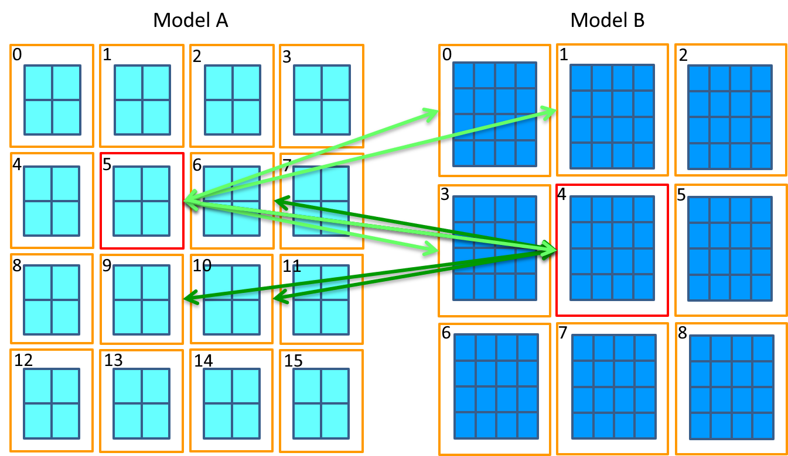
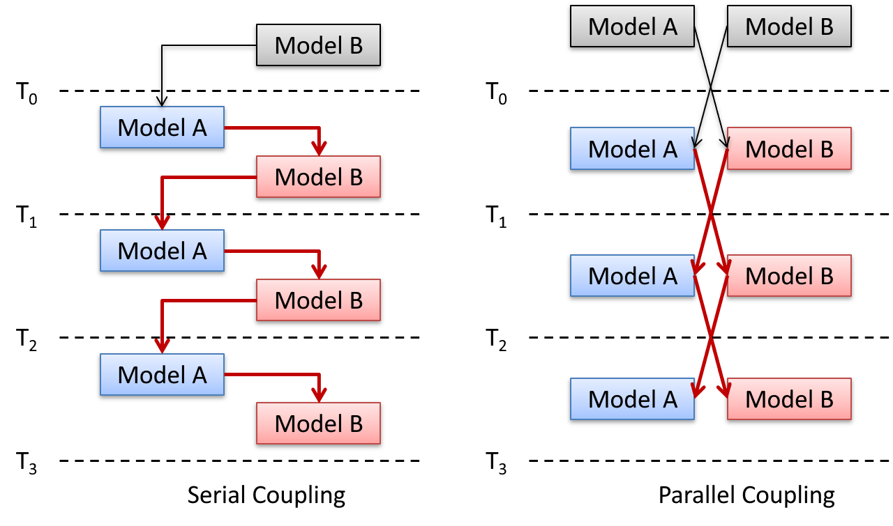
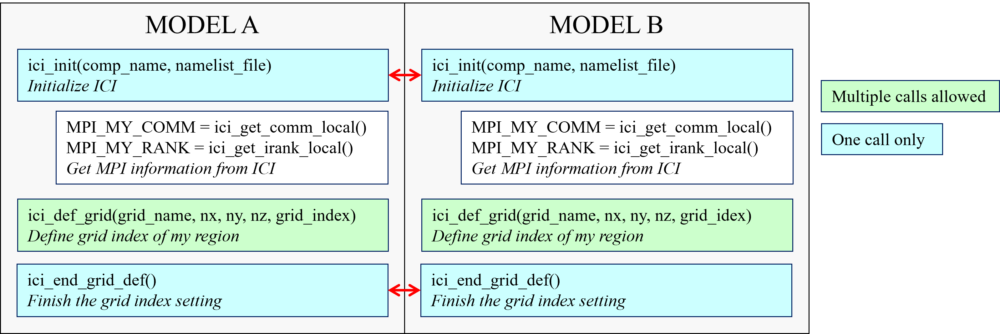
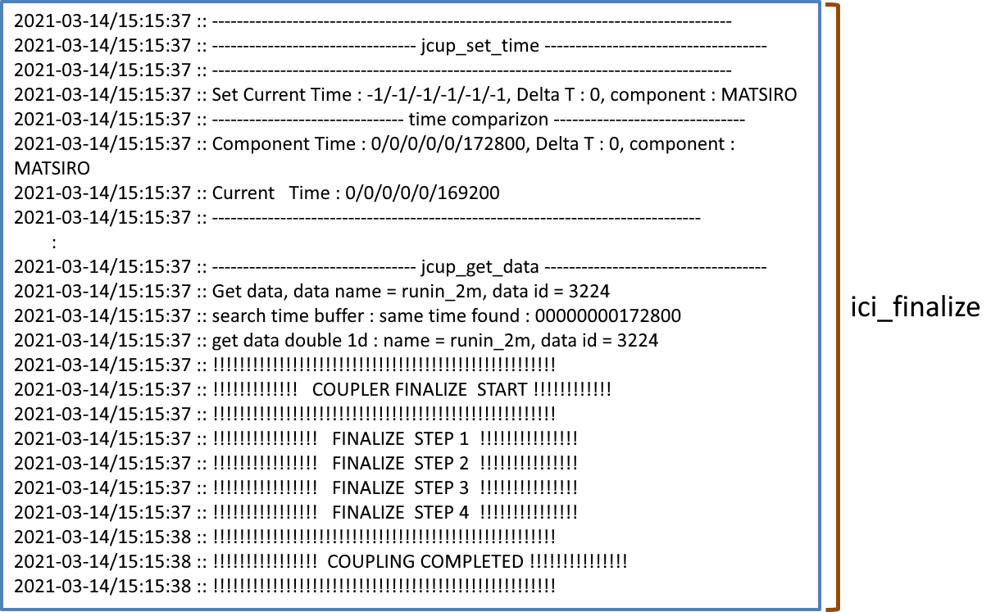

---
author:
- Yoshimura Lab. Univ. of Tokyo
date: 2021/03/30
title: |
  ILS Coupling Interface User's Guide Version 2.0
--- 


- [Introduction to coupled simulation](#introduction-to-coupled-simulation)
- [Introduction](#introduction)
  - [Overview of ICI](#overview-of-ici)
  - [Overview of coupling](#overview-of-coupling)
    - [Model requirements for coupling](#model-requirements-for-coupling)
    - [Coupling pattern](#coupling-pattern)
    - [Data exchange](#data-exchange)
- [Preparation](#preparation)
  - [Grid index table](#grid-index-table)
  - [Mapping table](#mapping-table)
  - [Configuration file](#configuration-file)
- [How to use the API subroutines](#how-to-use-the-api-subroutines)
  - [Overview of their usage](#overview-of-their-usage)
  - [Initialization](#initialization)
    - [Overview of initialization](#overview-of-initialization)
    - [Initialize ICI](#initialize-ici)
    - [Get MPI information](#get-mpi-information)
    - [Set grid index](#set-grid-index)
    - [Set interpolation table](#set-interpolation-table)
  - [Processing before time integration](#processing-before-time-integration)
    - [Overview of preprecessing](#overview-of-preprecessing)
    - [Exchange of various information](#exchange-of-various-information)
    - [Set initial time](#set-initial-time)
    - [Exchange of initial data](#exchange-of-initial-data)
    - [Initial value Put](#initial-value-put)
  - [Time integration](#time-integration)
    - [Overview of time integration](#overview-of-time-integration)
    - [Setting of current time and $\Delta{T}$](#setting-of-current-time-and-deltat)
    - [Obtaining the data](#obtaining-the-data)
    - [Putting the data](#putting-the-data)
  - [Ending process](#ending-process)
  - [Other main routines](#other-main-routines)
    - [Get MPI information](#get-mpi-information-1)
    - [Configuration information acquisition routine](#configuration-information-acquisition-routine)
    - [Log output routine](#log-output-routine)
    - [Execution information acquisition routine](#execution-information-acquisition-routine)
- [Implementation of coupling code](#implementation-of-coupling-code)
  - [Overview of implementation](#overview-of-implementation)
  - [From initialization to setting the grid index](#from-initialization-to-setting-the-grid-index)
  - [Interpolation table setting](#interpolation-table-setting)
  - [Getting initial data](#getting-initial-data)
  - [Coupling code in the time step loop](#coupling-code-in-the-time-step-loop)
  - [Code for finalize](#code-for-finalize)
- [When you encounter an error](#when-you-encounter-an-error)
  - [First of all](#first-of-all)
  - [Log files](#log-files)
    - [Jcup log](#jcup-log)
      - [Initialization log](#initialization-log)
      - [Preprocessing log](#preprocessing-log)
      - [Time integration log](#time-integration-log)
      - [Finalization log](#finalization-log)
  - [ICI log](#ici-log)
    - [Configration file read log](#configration-file-read-log)
    - [Component setting log](#component-setting-log)
    - [Interpolation table log](#interpolation-table-log)
    - [Received data monitor log](#received-data-monitor-log)
  - [Classification of the error](#classification-of-the-error)
  - [Case where the coupler detected an error](#case-where-the-coupler-detected-an-error)
  - [Case where the program does not finish](#case-where-the-program-does-not-finish)
  - [Case where a runtime error occurred](#case-where-a-runtime-error-occurred)
  - [Cases with anomalies in the data](#cases-with-anomalies-in-the-data)
- [References](#references)
  - [APIs of ICI](#apis-of-ici)
    - [Initialization APIs](#initialization-apis)
    - [APIs in the time integration loop](#apis-in-the-time-integration-loop)
    - [Finalize API](#finalize-api)
    - [Other APIs](#other-apis)
      - [Query APIs of MPI setting](#query-apis-of-mpi-setting)
      - [APIs for sending/receiving values](#apis-for-sendingreceiving-values)
      - [Configuration query APIs](#configuration-query-apis)
      - [Execution information query API](#execution-information-query-api)
   - [Revision history](#revision-history)


# Introduction to coupled simulation
This chapter provides an overview of coupled calculations.
Readers who have already conducted coupled calculations or are familiar with such calculations can skip this chapter.

First, the physical aspects of a coupled calculation are described.
The weather/climate is formed through the interaction of multiple physical elements, such as the atmosphere and ocean.
For example, momentum from the atmosphere to the ocean surface and sensible heat from the ocean surface to the lower boundary of the atmosphere are transported(below figure).
Therefore, in a simulation model expressing these phenomena, it is necessary to exchange physical quantities corresponding to them.
At this time, each model executes a calculation on an appropriate grid system and time scale according to the physical phenomena represented by the model.
Therefore, to exchange data between models having mutually different grid systems and time scales, appropriate time management and grid remapping are required.

*Schematics of Atmosphere-Ocean interaction(from Encyclopedia of the Environment, https://www.encyclopedie-environnement.org/en/air-en/biosphere-hydrosphere-and-cryosphere-models/*

Next, a computational aspect of a coupled calculation is described.
Modern high-performance computers operate a plurality of arithmetic units in parallel.
When running a simulation model on a high-performance computer, the model must correspond to the architecture of such a computer.
This correspondence is generally realized through a domain decomposition that divides the model grid.
In addition, in a coupled calculation, a plurality of models are executed in parallel.
Therefore, when exchanging data, it is necessary to conduct a data exchange between appropriate processes in consideration of a domain decomposition.
 Next figure shows an example of such a data exchange.
Here, it is assumed that model A has an 8 × 8 grid, and model B has a 12 × 12 grid, and is divided into 4 × 4 and 3 × 3 regions, respectively.
Each region is numbered as shown in the figure.
As indicated by the light green arrow, region 5 of model A exchanges data with regions 0, 1, 3, and 4 of model B.
By contrast, as indicated by the dark green arrows, region 4 of model B exchanges data with regions 6, 7, 10, and 11 of model A.

It is inappropriate to make individual software for conducting such a complex data exchange for each model, and therefore dedicated software for performing a coupled calculation is generally used.
This software is called a coupler or a coupling library.

As mentioned above, there are three main tasks for a coupler:
- Control of data exchange timing
- Grid remapping
- Data exchange between appropriate processes


*Data exchange example*

# Introduction
## Overview of ICI
An ILS is composed of multiple component models, such as a land surface model, MATSIRO; a river model, CaMa-Flood; and a water resources model, HO8.
To couple these component models, an ILS uses ICI(ILS Coupling Interface) as a coupling library.
ICI is used as the base library of the coupling library Jcup, and provides users with a simpler API specialized for ILS as shown in the Next figure.
The features of ICI can be summarized as follows.

- An arbitrary number of two or more components can be coupled
- Each component can be coupled in series or in parallel
- Each component is parallelized through a domain decomposition
- Any grid system can be applied when it has a uniquely numbered grid
- One component model can have multiple grid systems
- An exchange time interval can be set for all data
- Unlimited number of exchangeable data
- Multiple data can be sent and received together based on the configuration


*Coupling code structure of ILS*


## Overview of coupling
### Model requirements for coupling
The model components to be coupled are assumed to be non-parallel or parallelized by domain decomposition. The partitioning pattern must not change with time, and the grid point numbers of each region must be invariant. In addition, the grid point numbers of each region must be uniquely numbered. However, the numbers do not necessarily have to be consecutive.

The data exchange time interval is fixed for each data, and the time of the time integration step of the model must be the same as the data exchange time. However, the model time other than the data exchange time may vary.

### Coupling pattern
ICI can couple two (or more) model components in series and in parallel.
Here, serial refers to a case in which two components pass data during the same time step, and parallel refers to a case in which two components pass data of a previous time step to each other.
A schematic diagram of both patterns is shown in \figref{fig:coupling_pattern}.
The left figure is a serial coupling example, in which the calculation result of model A is passed to model B during the same time step, and the calculation of model B is conducted.
In serial coupling, each model component waits for the end of the calculation of the other component, and thus the overall execution time is substantially equal to the sum of the execution times of the two components.
The right figure shows an example of a parallel coupling, where the model component sends the calculation result to the other side component at each time step, and receives the data of the other side component at the next time step.
In this case, the overall execution time is approximately equal to the time of the component with the longest execution time.
The gray squares before $ T_0 $ indicate the initial value exchange.


*Coupling pattern(left：serial coupling、right：parallel coupling）*

### Data exchange
The data exchange time interval can be set for each data.
In the example shown in the next figure, model B exchanges data with model C every four steps, and model A every five steps.
At the time of a data exchange, each model requires that the model time coincide with the data exchange time.
Time steps other than the data exchange time do not need to be constant.

*Data exchange pattern*


# Preparation
## Grid index table

Which region (MPI process) of the target component to which all grid
point data are exchanged is determined by the grid point index assigned
to each area of the component model and the mapping table described in
the next section.

The grid point index of the grid assigned to each region is given to the
coupler by the ICI API subroutine ici_def_grid. The index must be made
up of natural numbers. In addition, it does not need to be continuous,
and a discrete number can be applied.

However, the numbers need to be unique among the grid points of all
regions. Because the coupler does not check for duplicate numbers, an
operation in the presence of duplicate grid points cannot be predicted.
One component can have a plurality of grids, and the number of grid
points and the grid point index of each grid can be set independently.

## Mapping table

An ICI does not depend on the grid structure and can flexibly couple the
models whose grid does not change over time. However, for this purpose,
it is necessary to obtain the correspondence between grid indexes among
the models and the interpolation coefficients in advance. For example,
as shown in , the value of grid point R(p) of the receiving model is
calculated from grid points $S(i)-S(i+4)$ and coefficient
$Cs(i)-Cs(i+4)$, as shown the equation below:

$$R(p) = \sum_{n=0}^{4} Cs(i+n)*S(i+n)$$

The mapping table for $R(p)$ can be expressed as . For the vector
quantity, a coefficient expressing rotation is further added. These
values are given as arguments of the ICI API subroutine
ici_set_interpolation_table to be described later.

*Grid point index and coefficients on interpolation calculation*

*Example of mapping table*
``` {#list:mapping_table_sample caption="Example of mapping table" label="list:mapping_table_sample"}
 R(p), S(i), Cs(i)
 R(p), S(i+1), Cs(i+1)
 R(p), S(i+2), Cs(i+2)
 R(p), S(i+3), Cs(i+3)
 R(p), S(i+4), Cs(i+4)
```

## Configuration file

ICI uses configuration files and API subroutines to define its behavior.
The default file name of the configuration file is \"couplig.conf\".
What users need to set in the configuration file are the coupler_config
session, which specifies the operation of the coupler, and the nam_ici
session, which defines the exchange data. The elements, descriptions,
and possible values for each session are summarized in the next three tables.

The session coupler_config consists of three elements, log_level,
debug_mode and grid_checker. Of these, log_level sets the detailedness
(amount) of the log output. Possible values include \"SILENT,\"
\"WISPER,\" and \"LOUD.\" The latter value outputs a more detailed log.
Debug_mode is a flag indicating whether to output a log to stderr.
Grid_checker is a flag to check the validity of grid points and
interpolation table settings, and is set to .false. by default.

The session nam_ici describes the sending/receiving components and
grids, the grid, and the data group exchanged between these components.
A plurality of data can be set for a pair of components and a grid, and
all data are interpreted as corresponding to the component and the grid
described immediately before. Settings that can be omitted are shown in
italics in the table.

Var_put and var_get are exchange data names, and var_put_vec and
var_get_vec are exchange vector data names. Either a scalar data name or
a vector data name must be specified. Mapping_tag is a tag for
specifying a mapping table. Time_intpl_tag is a data identification tag
for time interpolation, and data with the same numbered tag are passed
to the time interpolation subroutine of the IO component. This tag is
valid only when retrieving data from ILSIO, the IO component of ILS, and
can be omitted for other couplings. Grid_intpl_tag is a data
identification tag for spatial interpolation, and data with the same
number are exchanged as a set of data and passed to the spatial
interpolation subroutine. Intvl sets the data exchange interval in
seconds. Lag sets the coupling pattern. When two components are coupled
in parallel, a value of -1 is given to both the sending and receiving
data, and when they are coupled in series, a value of 1 is given to the
preceding component and a value of -1 is given to the succeeding
component. In addition, 0 indicates a special setting, and is set only
when the initial data are acquired from the IO component using the API
subroutine ici_get_initial_data described later. Layer is an integer
indicating the number of vertical layers of data. Flag is a flag
indicating whether to calculate the time average internally, and
specifies \"SNP\" or \"AVR.\"Factor is a real constant that is
multiplied with the data at the spatial interpolation. Is_ok is a flag
indicating whether a data exchange is actually conducted. If is_ok = 1,
the data are exchanged, and if the value is 0, the data are not
exchanged. A sample of the configuration file is shown in the list below.
<br>

*Elements of coupler_config session of configuration file*

| element name  | description　               |possible values|
| --------------| --------------------------- | --------------------------
| log_level     | log output level            |one of \"SILENT,\" \"WISPER,\" \"LOUD\"|
| debug_mode    | Flag to output log to stderr| .true. or .false.|
 
<br>

*Elements of nam_ici section (component and grid setting)*

| element name   |description                            |possible value|
| -------------- |-------------------------------------- |------------------------------|
| comp_put       |sending component name                 |string of the component name|
| comp_get       |receiving component name               |string of the component name|
|  grid_put      | grid name of the sending component    | string of the grid name|
|  grid_get      | grid name of the receiving component  | string of the grid name|

<br>

*Elements of nam_ici section (exchange data setting)*

|  element name       |description　                      |possible value|
|  ------------------ |---------------------------------- |------------------------------------------|
|  var_put            |send data name                     |string of the name|
|  var_get            |receive data name                  |string of the name|
|  var_put_vec        |send vector data name              |string of the name|
|  var_get_vec        |receive vector data name           |string of the data name|
|  *mapping_tag*      |mapping table tag                  |integer for specifying the mapping table|
|  *time_intpl_tag*   |time interpolation tag             |integer for identifying the data||
|  intvl              |data exchange interval             |integer in second|
|  lag                |coupling pattern                   |-1 or 0 or 1|
|  *layer*            |number of vertical layer           |integer for vertical layer (default 1)|
|  flag               |time averaging flag                |\"SNP\" or \"AVR\"|
|  *factor*           |value multiplied to the data       |real(kind=8) (default 1)|
|  *is_OK*            |flag to exchange the data or not   |1 or 0 (default 1)|


<br>

*Example of ICI configuration*


``` 
&coupler_config
  log_level = "LOUD"
  debug_mode  = .true.
&end 


&nam_ICI  comp_put = "MATIO",   comp_get = "MATSIRO",
          grid_put ='io_grid', grid_get ='matsiro_grid', /
&nam_ici  var_put = 'lon'       ,  var_get ='lon'       , time_intpl_tag = 5, grid_intpl_tag = 1, intvl=3600 ,  lag=0,  flag='SNP' /
&nam_ici  var_put = 'lat'       ,  var_get ='lat'       , time_intpl_tag = 5, grid_intpl_tag = 1, intvl=
&nam_ICI  var_put = 'SWdown'    ,  var_get ='SWdown'    , time_intpl_tag = 1, grid_intpl_tag = 1, intvl=3600 ,  lag=-1, flag='SNP' /
&nam_ICI  var_put = 'LWdown'    ,  var_get ='LWdown'    , time_intpl_tag = 2, grid_intpl_tag = 1, intvl=3600 ,  lag=-1, flag='SNP' /
&nam_ICI  var_put = 'Rainf'     ,  var_get ='Rainf'     , time_intpl_tag = 2, grid_intpl_tag = 1, intvl=3600 ,  lag=-1, flag='SNP' /
```

# How to use the API subroutines

## Overview of their usage

To implement ICI routines into a model component, pass the path to the
ICI library and module files, and use the API module ici_api. The ICI
API routines are roughly divided into four categories: initialization,
data processing before time integration, data processing during time
integration, and termination.

## Initialization
### Overview of initialization

A typical usage of the ICI API during initialization is as follows figure. The
first three subroutine calls ici_split_world and ici_set_my_world are
procedures to split the global communicator(MPI_COMM_WORLD) in order to
couple the ILS with other coupled models (e.g., atmosphere-ocean
coupling). The communicator splitted by ici_split_world is given as the
global communicator of the ILS through ici_set_my_world. Next,
initialize the ICI with ici_init, then get the MPI information set by
the ICI with ici_get_comm_local and ici_get_irank_local, set the grid
point numbers for each region of the component with ici_def_grid, and
end the configuration with ici_end_grid_def. and notify ICI of the end
of the configuration with ici_end_grid_def. Finally, the mapping table
is set with ici_set_interpolation_table.

*Typical use of the ICI API in initial configuration*

### Initialize ICI

First, initialize the ICI with ici_init. The arguments are the name of
the component and the name of the configuration file. Currently,
\"coupling.conf\" is commonly used as the file name for the
configuration file.

### Get MPI information

As shown by the next figure, the MPI communicator of each component when coupled by the
ICI is generated inside the ICI. Therefore, the communicator used when a
component calls an MPI routine must be the one generated by the ICI. The
communicator generated by the ICI can be obtained using the API function
ici_get_comm_local. In addition, the process number inside the component
can be obtained from the ICI API routine.

*Status of the MPI communicator when the component is alone and when it is coupled with ICI (left figure: component alone, right figure: coupled with ICI*

### Set grid index

Set the grid point number with ici_def_grid. The arguments are a grid
name, a grid size $(nx, ny, nz)$, and a one-dimensional array
grid_index(:) of the grid point indexes. What should be noted here is
whether to include the vertical dimension in the array of the grid point
indexes to be given. For example, in the case of atmosphere-ocean
coupling, the exchange data are two-dimensional horizontally, and even
if a third dimension exists, in numerous cases, it is not a physical
vertical layer but a quantity such as a category. Further, even when
exchanging data such as atmosphere and chemistry coupling in a physical
three-dimensional space, the grid differs only in the horizontal plane,
and vertical interpolation may not be necessary in certain cases. When
the mapping table is expressed only in the horizontal plane as in these
examples, even if the data to be exchanged have a vertical layer, the
grid index setting is $nz = 1$, and the size of the grid_index is
$nx *ny$. The above is summarized as follows.

-   When the exchange data are horizontal 2D data or the interpolation
    calculation is horizontally 2D only

    nz = 1, and grid_index is given as an array of size $nx * ny$.

-   Interpolation calculation in 3D space including vertical

    grid_index is given as an array of size $nx * ny * nz$.

When exchanging 3D data including a vertical layer in the former case,
the number of vertical layers is given to the layer by setting
individual data in the setting file.

### Set interpolation table

The interpolation table setting subroutine ici_set_interpolation_table must be
called by both the sending component and the receiving component.
Because a data exchange is conducted inside this subroutine, the calling
location must correspond in the sending and receiving components.
Arguments after the grid point index are optional arguments and are
given by the receiving component. Further, when the data to be exchanged
are only of a scalar amount or there is no rotation of the grid, it is
not necessary to provide two arguments of coef_sin and coef_cos. The
above results are shown in the next table.

<br>

*Arguments of ici_set_interpolation_table*

|  Arguments        |meaning                     |Criteria to give　
|  ---------------- |--------------------------- |-------------------------------
| send_comp_name    |send component name         |
|  send_grid_name   |send grid name              |give both
|  recv_comp_name   |receive component name      |component
|  recv_grid_name   |receive grid name           |　
|  send_index       |send grid index             |give on the
|  recv_index       |receive grid index          |receive component
|  coef             |interpolation coefficient   |
|  coef_sin         |rotation coefficient        |give on the receive component
|  coef_cos         |rotation coefficient        |and rotation is necessary


<br>

## Processing before time integration

### Overview of preprecessing

Before entering the time integration loop, it is possible to exchange
the necessary information and initial values. It is also necessary to
put the data that will be exchanged during the first step of time
integration loop. An overview of these API calls is shown in the next figure.

*Typical use of the ICI API before the time integration loop*

### Exchange of various information

If it is necessary to communicate various information before time
integration, such as the start time of integration, data exchange is
performed using ici_send_value and ici_recv_value. The arguments are the
component name of the other side and the value to be communicated. The
second argument can be a string, integer, integer array, real number, or
real number array. These routine calls must be corresponded to each
other.

### Set initial time

Give the initial time with ici_set_init_time. The argument is an integer
array of size 6, representing the year, month, day, hour, minute, and
second.

### Exchange of initial data

The API subroutines ici_put_data and ici_get_initial_data are used to
exchange initial grid data. The data to be sent and received must be
defined with lag=0 in the configuration file and the routine calls of
ici_put_data and ici_get_initial_data must correspond for lag=0 data
exchange.

### Initial value Put

Before entering the time integration loop, the sending side must put the
data received in the first step. The API subroutine is ici_put_data or
ici_put_data_vec, and the arguments are the data name and data (one
variable for the scalar data and two variables for the vector data).

## Time integration

### Overview of time integration

The ICI API calls and internal operations in the time integration loop
are shown in the figure below. There are three API routines used in the time integration
loop: ici_set_time, ici_get_data, and ici_put_data. At the
beginning(near the beginning) of the time integration loop, Ici_set_time
should be called to give the current time and $\Delta{T}$ to the ICI.
The data exchange and interpolation calculations are performed inside
this routine. Therefore, if there is an inter-component load imbalance,
there will be a wait in this subroutine. These API routines must be
called every step.

*Typical use of the ICI API in the time integration loop*

### Setting of current time and $\Delta{T}$

Call the API routine ici_set_time in the time integration loop and give
the current time and $\Delta{T}$. The arguments are an integer array of
size 6 representing the year, month, day, hour, minute, and second, and
an integer representing $\Delta{T}$. Note that (currently) the unit of
$\Delta{T}$ is only in seconds. Because processing inside the coupler,
such as a data exchange determination, uses the integrated value of
$\Delta{T}$, ici_set_time must be called at every step.

### Obtaining the data

To obtain the target data, call ici_get_data or ici_get_data_vec. The
argument data_name is the data name, and data, or data1, data2, is the
receiving data array. The optional argument data_scalar is a scalar
quantity received at the same time as these data, and the optional
argument data_scalar must also be given in ici_put_data of the
corresponding target component. The optional argument is_get_OK is a
logical type argument that returns whether the step is a data receiving
step.

### Putting the data

To send data, ici_put_data or ici_put_data_vec is called, which is the
same as the initial value, Put. The argument data_name is the data name,
and data, or data1 and data2, are sending data arrays. The optional
argument data_scalar is the scalar quantity to be sent at the same time
as these data. If the step is not a sending step, the processing is
appropriately conducted (sending is skipped) inside the coupler, and
thus it is not necessary for the user to make a call determination
according to the step.

## Ending process


Finally, ici_finalize is called at the end of the coupling. The argument
is_exchange_data is a flag for sending/receiving the last step data
inside ici_finalize when the last step data are not sent/received owing
to the time integration step algorithm. Here, \"is_call_finalize\" is a
flag indicating whether to call the MPI termination routine MPI_finalize
internally.

## Other main routines

### Get MPI information

In addition to the communicator acquisition function ici_get_comm_local,
ici_get_irank_local, which returns the rank of its own component, and
ici_get_numpe_local, which returns the number of ranks, are provided. A
subroutine ici_get_mpi_parameter for obtaining MPI information at a
particular time is also provided.

### Configuration information acquisition routine

Although not required for normal use of the ICI, there are routines that
return the settings in the configuration file for special purposes. See
the references for details on the individual routines.

### Log output routine

Here, ici_put_log outputs a Jcup format log to a Jcup log file. The
argument sub_name is the name of the subroutine, and log_str is the
character string of the log.

### Execution information acquisition routine

Here, ici_is_coupled is a function that returns whether the component
specified by the argument comp_name is currently running (coupled).

# Implementation of coupling code

## Overview of implementation

In this chapter, the procedure for implementing the coupling code is
explained based on a concrete example. The example we will refer to is
MASTSIRO, where the code for coupling is implemented in
mod_driver_matsiro.f90 and mod_io.f90 under the ILS/src/adm directory.

## From initialization to setting the grid index

The coupling code from initialization to grid index setting is shown in
the next list. ici_split_world and ici_set_my_world are used to get and set the
communicator used by the ILS. Next, the local MPI information used by
MATSIRO is obtained by ici_get_numpe_local to ici_get_comm_local.
ici_is_coupled is a function that returns whether or not the model
components given as arguments are coupled. This function allows us to
know which component is running at runtime. After calculating the local
grid size ijmax and grid point index index_global, these values are set
through ici_def_grid and finally finish setting with ici_end_grid_def.

*Code of initialization process*
``` {#list:code_init caption="Code of initialization process" label="list:code_init"}
    !---------------------------------------------------------------------------
    ! Initial setting of ICI
    !---------------------------------------------------------------------------
    call ici_split_world(0, my_comm_world) ! A-O communicator
    call ici_split_world(1, my_comm_world) ! ILS communicator
    call ici_set_my_world(my_comm_world)

    call ici_init(my_comp, namelist_ici_file)
    call palm_TimeInit("MATSIRO", comm=ici_get_comm_local())
    !---------------------------------------------------------------------------
    ! Get my rank and the total number of PE
    !---------------------------------------------------------------------------
    petot = ici_get_numpe_local()
    rid = ici_get_irank_local()
    comm = ici_get_comm_local()
    !---------------------------------------------------------------------------
    ! Get information of other MPMD components
    !---------------------------------------------------------------------------
    coupled_matio = ici_is_coupled('ILSIO')
    coupled_cama  = ici_is_coupled('CAMA')
    coupled_agcm  = ici_is_coupled('AGCM')

    call palm_TimeStart( 'Setup' )
    !---------------------------------------------------------------------------
    ! Open log file
    !---------------------------------------------------------------------------
    write(cfile, "('matsiro.out.r', i4.4)") rid
    open(jfpar, file=cfile, form='formatted', status='replace')
    write(jfpar,*)
    write(jfpar,*) 'MATSIRO global simulation'
    write(jfpar,*) '+ MATSIRO I/O component coupled? : ', coupled_matio
    write(jfpar,*) '+ CaMa coupled?                  : ', coupled_cama
    write(jfpar,*)
    write(jfpar, nml=matsiro_drv)
    write(jfpar, nml=matsiro_ici)
    !---------------------------------------------------------------------------
    ! Get IJMAX for all PEs
    !---------------------------------------------------------------------------
    allocate(counts(petot))
    allocate(displs(petot))
    call get_grid_numbers(ijmax_global, petot, counts, displs)
    !---------------------------------------------------------------------------
    ! Get local IJS, IJE, and IJMAX
    !---------------------------------------------------------------------------
    call get_local_grid(ijmax_global, petot, rid, ijs, ije)
    ijmax = ije - ijs + 1
    !---------------------------------------------------------------------------
    ! Set ICI grid
    !---------------------------------------------------------------------------
    allocate(index_global(ijmax))
    counter = 0
    do ij = ijs, ije
      counter = counter + 1
      index_global(counter) = ij
    enddo

    call ici_def_grid(my_grid, ijmax, 1, 1, index_global)
    call ici_end_grid_def()
```

## Interpolation table setting

The interpolation table setting program is implemented in the subroutine
set_interpolation_table. The code for set_interpolation_table is shown
in the list below. In this subroutine, the interpolation table setting information
is read from the MATSIRO configuration file at the beginning. Next, if
the interpolation table file name is given in the configuration
information, the interpolation table file is read. The values of the
file are assigned to the variables send_data_index, recv_data_index, and
coef, and passed as arguments to the subroutine
ici_set_interpolation_table. If the interpolation table file name is not
given, ici_set_interpolation_table will be called without these
arguments. In this case, these values must have been provided on the
peer component side.

*Code of set_interpolation_table*
``` {#list:set_interpolation_table caption="Code of set\\_interpolation\\_table" label="list:set_interpolation_table"}
subroutine set_interpolation_table(rid)
    use matsiro_parameters, only : ifpar, jfpar
    use ici_api, only : ici_set_interpolation_table
    implicit none
    !
    ! Input
    integer, intent(in) :: rid
    !
    ! Internal work
    type intpl_type
      character(128) :: send_comp
      character(128) :: send_grid
      character(128) :: recv_comp
      character(128) :: recv_grid
      integer, pointer :: send_data_index(:)
      integer, pointer :: recv_data_index(:)
      real(8), pointer :: coef(:)
    end type
    type(intpl_type) intpl
    !
    ! Internal parameter
    integer :: fid = 101
    !
    integer :: ijmax_map
    character(128) :: send_comp
    character(128) :: send_grid
    character(128) :: recv_comp
    character(128) :: recv_grid
    character(128) :: map_file
    character(128) :: intpl_file
    namelist /matsiro_ici_intpl/ ijmax_map, send_comp, send_grid, recv_comp, &
                               & recv_grid, map_file, intpl_file
    !---------------------------------------------------------------------------
    rewind(ifpar)
    do
      ijmax_map = 1
      send_comp = ""
      send_grid = ""
      recv_comp = ""
      recv_grid = ""
      map_file = ""
      intpl_file = ""
      read(ifpar, nml=matsiro_ici_intpl, end=1100)
      write(jfpar, nml=matsiro_ici_intpl)
      intpl%send_comp = send_comp
      intpl%send_grid = send_grid
      intpl%recv_comp = recv_comp
      intpl%recv_grid = recv_grid
      !---------------------------------------------------------------------------
      ! Not putting mapping/interpolation table from this component
      !---------------------------------------------------------------------------
      if (map_file == "") then
        call ici_set_interpolation_table(intpl%send_comp, intpl%send_grid, &
                                       & intpl%recv_comp, intpl%recv_grid)
        cycle
      endif
      !---------------------------------------------------------------------------
      ! Putting mapping/interpolation table from this component
      !---------------------------------------------------------------------------
      if (rid == 0) then
        allocate(intpl%send_data_index(ijmax_map))
        allocate(intpl%recv_data_index(ijmax_map))
        open(fid, file=map_file, access='DIRECT', recl=ijmax_map*4, status='old')
        read(fid, rec=1) intpl%send_data_index
        read(fid, rec=2) intpl%recv_data_index
        close(fid)
        !
        allocate(intpl%coef(ijmax_map))
        if (intpl_file == "") then
          intpl%coef(:) = 1.d0
        else
          open(fid, file=intpl_file, access='DIRECT', recl=ijmax_map*8, status='old')
          read(fid, rec=1) intpl%coef
          close(fid)
        endif
        !
        call ici_set_interpolation_table(intpl%send_comp, intpl%send_grid, &
                                       & intpl%recv_comp, intpl%recv_grid, &
                                       & intpl%send_data_index, &
                                       & intpl%recv_data_index, &
                                       & intpl%coef)
        deallocate(intpl%coef)
        deallocate(intpl%recv_data_index)
        deallocate(intpl%send_data_index)
      else
        allocate(intpl%coef(1))
        call ici_set_interpolation_table(intpl%send_comp, intpl%send_grid, &
                                       & intpl%recv_comp, intpl%recv_grid, &
                                       & coef=intpl%coef)
        deallocate(intpl%coef)
      endif
    enddo
1100 continue
  end subroutine set_interpolation_table
```

## Getting initial data

After the subroutine set_interpolation_table is called, ici_init_time is
called to set the initial time. Next, the initial data is retrieved in
the subroutine get_bnd. A part of the subroutine get_bnd is shown in the
next list. Here, the initial data is obtained by ici_get_initial_data.

*Code of get_bnd*
``` {#list:get_bnd caption="Code of get\\_bnd" label="list:get_bnd"}
subroutine get_bnd ( &
           & sffrac, sffrac_prev, lkfrac, lkfrac_prev, ixlsfc, ixlsoil, &
           & gralbv, gralbn, gralbl, xgrtans, xgrzsd, gazsd, &
           & ctiav, cti36p, cti95p, grco2m, grsndx0, &
           & latitude, hhclm, ijmax )
        :
        :
        :
    !---------------------------------------------------------------------------
    allocate(alon(ijmax))
    allocate(alat(ijmax))
    !
    ! Longitudes
    call ici_get_initial_data("lon", lon)
    !
    ! Latitudes
    call ici_get_initial_data("lat", lat)
    !
    pi = atan(1.d0) * 4.d0
    alon(:) = lon(:) / 180.d0 * pi
    alat(:) = lat(:) / 180.d0 * pi
    !
    call ici_get_initial_data("lkfrac", lkfrac)
    lkfrac_prev(:) = lkfrac(:)
    call ici_get_initial_data("lkdep", hhclm)
    hhclm(:) = hhclm(:) * 1.d2 !! cm
    do ij = 1, ijmax
      hhclm(ij) = min(lksh_hhmin, hhclm(ij))
    enddo

     :
     :
     :

   if (opt_ssnowd .and. sncv_idxrd) then
      call ici_get_initial_data("grsndx", tmp8)
      do m = 1, multcy
        grsndx0(:,m) = tmp8(:)
      enddo
    endif
    !
    ! latitude
    latitude(:) = alat(:)
  end subroutine get_bnd
```

## Coupling code in the time step loop

The time step loop is implemented in the main program
driver_matsiro.f90. The code of main program is shown in the next list. The time
setting subroutine ici_set_time is called in the time step loop \"do
while\". The MATSIRO calculations are performed in the subroutine
matsiro_run shown in the 2nd list. First, the subroutine get_met is called.
Within this subroutine, as shown in the 3rd list, ici_get_data is called to
retrieve the data. After performing the main MATSIRO calculation in the
ij loop, ici_put_data is called to pass the various data to ICI.

*Code of main program*
``` {#list:driver_matsiro caption="Code of main program" label="list:driver_matsiro"}
program driver_matsiro
  use palmtime, only :  &
    & palm_TimeStart, &
    & palm_TimeEnd
  use ici_api, only : &
    & ici_set_time, &
    & ici_finalize
  use mod_time, only : &
    & update_time
  use mod_driver_matsiro, only : &
    & matsiro_init, &
    & matsiro_run, &
    & matsiro_fin
  implicit none
  !-----------------------------------------------------------------------------
  ! Description:
  !     This program is a driver of MATSIRO land surface model
  !-----------------------------------------------------------------------------
  real(8) :: time, time_end, delt
  integer :: idate(6)
  !
  ! Initial settings
  call matsiro_init(idate, time, time_end, delt)
  !
  ! Time loop
  call palm_TimeStart( 'Main' )

  do while (time < time_end)

    call palm_TimeStart( 'ICI_sync' )
    call ici_set_time(idate, int(delt))
    call palm_TimeEnd  ( 'ICI_sync' )

    call palm_TimeStart( 'MATSIRO_driver' )
    call matsiro_run(idate, time)
    call update_time(idate, time, delt)
    call palm_TimeEnd  ( 'MATSIRO_driver' )

  enddo
  !
  call palm_TimeEnd  ( 'Main' )

  ! Finalize
  call matsiro_fin()
  call ici_finalize(.true., .true.)
end program driver_matsiro
```

*Code of matsiro_run*
``` {#list:matsiro_run caption="Code of matsiro\\_run" label="list:matsiro_run"}
subroutine matsiro_run(idate, time)
      :
      :
      :
    !---------------------------------------------------------------------------
    ! Get meteorological forcing
    !---------------------------------------------------------------------------
    call palm_TimeStart( '_get_Boundary' )
    call get_met ( &
      &  gaua, gava, gata, gaqa, gapa, gaps, rfsfcd, rcosz,  &
      &  gprcc, gsnwc, gprcl, gsnwl, depfdu, depfbc, &
      &  idate, deltl, ilsfc, met_type, ijmax )
    call get_bnd_mon(grlaim, ijmax)
    if ( coupled_cama ) then
      call ici_get_data('runin_2m', tmp8, IS_GET_OK=is_get_ok)
      if (is_get_ok) rinn(:) = tmp8(:) / lkfrac(:) / dwatr * 1.d2  !! cm/sec
    endif
    call palm_TimeEnd  ( '_get_Boundary' )
    !---------------------------------------------------------------------------
    ! IJ Loop
    !---------------------------------------------------------------------------
    call palm_TimeStart( '_MATSIRO1d' )

    ud = 1
    do ij = 1, ijmax
      :
      ;MAIN CALCULATION of MATSIRO
      :
    enddo
      ;
      :
      :
    call ici_put_data("Qr_ice", glacr_all)
    call ici_put_data("Qss", runofs(:,1))
    call ici_put_data("Qsi", runofi(:,1))
    call ici_put_data("Qso", runofo(:,1))
    call ici_put_data("Qsb", runofb(:,1))
    call ici_put_data("WaterTableD", wtabd(:,1))
    call ici_put_data("SMSatAreaFrac", assat(:,1))
    call ici_put_data("SWup", swup(:,1))
    call ici_put_data("LWup", lwup(:,1))
    call ici_put_data("Qle", qle(:,1))
    call ici_put_data("Qh", qh(:,1))

    !---------------------------------------------------------------------------
    ! For CaMa
    !---------------------------------------------------------------------------
    if ( coupled_cama ) then
      call ici_put_data("runoff", runoff_all)
      call ici_put_data("lakefrc", lkfrac)
    endif
    call palm_TimeEnd  ( '_ICI_put' )

    return
  end subroutine matsiro_run
```
*Code of get_met*
``` {#list:get_met caption="Code of get\\_met" label="list:get_met"}
subroutine get_met ( &
         & gaua, gava, gata, gaqa, gapa, gaps, rfsfcd, rcosz, &
         & gprcc, gsnwc, gprcl, gsnwl, depfdu, depfbc, &
         & idate, delt, ixlsfc1, met_type, ijmax )
        :
        :
        :
    !---------------------------------------------------------------------------
    ! Radiation
    !---------------------------------------------------------------------------
    select case(trim(met_type))
      case('gcm')
        call ici_get_data('Rdown', rfsfcd)
        call ici_get_data('Cosz'  , rcosz)
      case('offline', 'offline_prcp')
        call ici_get_data('SWdown', swdown)
        call ici_get_data('LWdown', lwdown)
        call ici_get_data('CCover', cloud)
        do ij = 1, ijmax
          call shtins ( & ! incidence angle
             & sins, rcosz(ij),               & ! out
             & idate(1), idate(2), idate(3),  & ! in
             & idate(4), idate(5), 0, delt,   & ! in
             & alon(ij), alat(ij),            & ! in
             & nhsub ,                        & ! in
             & solcon                       )   ! in
          call radder(rfsfcd_1d, swdown(ij), lwdown(ij), cloud(ij), rcosz(ij))
          rfsfcd(ij,:) = rfsfcd_1d(:)
        enddo
    end select
    !---------------------------------------------------------------------------
    ! Wind
    !---------------------------------------------------------------------------
    select case(trim(met_type))
      case('gcm')
        call ici_get_data('Wind_E', gaua)
        call ici_get_data('Wind_N', gava)
      case('offline', 'offline_prcp')
        call ici_get_data('Wind', gaua)
        gava(:) = 0.d0
    end select
    !---------------------------------------------------------------------------
    ! Temperature & specific humidity
    !---------------------------------------------------------------------------
    call ici_get_data('Tair', gata)
    call ici_get_data('Qair', gaqa)
    !---------------------------------------------------------------------------
    ! Pressure
    !---------------------------------------------------------------------------
    call ici_get_data('Psurf', gaps)
    select case(trim(met_type))
      case('gcm')
        call ici_get_data('Pair', gapa)
      case('offline', 'offline_prcp')
        do ij = 1, ijmax
          gapa(ij) = gaps(ij) &
                 & - gaps(ij) / rair / gata(ij) * grav * (zref + vegh(ixlsfc1(ij)))
        enddo
    end select
        :
        :
        :
    !---------------------------------------------------------------------------
    ! BC/dust deposition
    !---------------------------------------------------------------------------
    call ici_get_data('DepDust', depfdu)
    call ici_get_data('DepBC', depfbc)

  end subroutine get_met
```

## Code for finalize

The coupling finalization subroutine ici_finalize is called at the end
of the main program.

# When you encounter an error

## First of all

When you encounter an error, the first thing to do is to turn on the
coupler log output. Specifically, in the coupler_config section of the
coupling.conf configuration file, set log_level to \"LOUD\" and set
debug_mode to .true. Next list is an example of the configuration. Since log
output is turned off by default, comment out the default setting and
remove the comments from the setting with log output.

*Log output setting*
``` {#list:log_output_config caption="Log output setting" label="list:log_output_config"}
#&coupler_config
#  log_level = "SILENT"
#  debug_mode  = .false.
#&end

 &coupler_config
   log_level = "LOUD"
   debug_mode  = .true.
 &end
```

## Log files

ICI outputs two types of log files. \"COMPONENT_NAME.log.PE?????\" files
output by ICI and \"COMPONENT_NAME.coupling.log.PE?????\" files output
by Jcup. The ICI log is always output. The contents of the log are the
settings of the exchanged data, the contents of the interpolation table,
and the monitored values of the data during data exchange.

The log of Jcup is output according to the log_level of the
configuration file. The content of the log is the detailed internal
operation of Jcup. Since the Jcup log is often referred to when an error
occurs, the correspondence between the contents of the log and the
related subroutines is shown in the following sections.

### Jcup log

#### Initialization log

An example of the initialization part of the log is shown in the next figure. 
The log of ici_def_grid outputs the size of the grid array and the minimum
and maximum of grid point index. Check these values, if an error related
to the grid point occured. Inside the subroutine ici_end_grid_def, the
end of grid setting subroutine and the send/receive data setting
subroutine are called. Therefore, the log of ici_end_grid_def will
output the information of send and receive data. Check this part of the
log in case of data related errors such as data not found. Although
omitted in the figure, the subroutine ici_set_interpolation outputs a
large amount of logs. By examining this log, you can find out at which
stage of the interpolation table process an error occurred or at which
stage the process is taking a long time.

*Initialization log*

#### Preprocessing log

An example of the preprocessing part of the log is shown in the next figure. The
log of ici_get_initial_data outputs the information of getting the data
defined lag=0 in the configuration file. All data defined as lag=0 in
the configuration file must be received at this stage. The log of
ici_put_data outputs the information of putting the data of time step=0.
All data defined in the configuration file must be put at this stage.

*Preprocess log*

#### Time integration log

An example of the log during time integration is shown in the next figure. 
The log of ici_set_time outputs the information of exchanging, interpolating and
buffuring the data. Although it is mostly omitted in the list, between
\"DATA EXCHANGE START\" and \"DATA EXCHANGE FINISH\", a large amount of
data exchange logs are output. Errors and communication failures that
occur during data exchange process are detected in this part of the log.
The log of ici_get_data and ici_put_data output the information of
getting and putting the data. ici_put_data must be called for the data
defined in the configuration file, but ici_get_data does not necessarily
need to be called.

*Time integration log*

#### Finalization log

An example of the finalization log is shown in the next figure. In the standard
coupling specification of ILS, the exchange of the final step data is
performed in the finalization process. Therefore, a log about the data
exchange is also output in the finalization log.

*Finalize log*

## ICI log

The file name of the log output by ICI is
\"COMPONENT_NAME.log.PE?????\". This log is always output. The log is
divided into four parts: configuration file read information, component
information, interpolation table information, and received data
information. Each of these is explained below.

### Configration file read log

An example of the configuration file read log is listed in the next list. The
information set in the num_ici section of the configuration file is
output in this part. To check if the settings are correct or if the file
was read correctly, check this part.

*Configuration file read log*
``` {#list:config_log caption="Configration file read log" label="list:config_log"}
------------------------------------------------------------------------------
 ici_init

 -
 ici_read_namelist (ici_namelist.f90): Read coupling.conf
      comp_put ,  comp_get     = 'ILSIO', 'MATSIRO'
      grid_put ,  grid_get     = 'io_grid1', 'matsiro_grid'
      mapping tag =            1

 ici_read_namelist (ici_namelist.f90): Read coupling.conf
        var_put    , var_get     = lon
                        , lon
         intvl =         3600
         lag   =            0
         flag  = SNP

 ici_read_namelist (ici_namelist.f90): Read coupling.conf
        var_put    , var_get     = lat
                        , lat
         intvl =         3600
         lag   =            0
         flag  = SNP

 ici_read_namelist (ici_namelist.f90): Read coupling.conf
        var_put    , var_get     = lkfrac
                        , lkfrac
         intvl =         3600
         lag   =            0
         flag  = SNP

 ici_read_namelist (ici_namelist.f90): Read coupling.conf
        var_put    , var_get     = lkdep
                        , lkdep
         intvl =         3600
         lag   =            0
         flag  = SNP
```

### Component setting log

An example of the component setting log is listed in the list below. mod_def_grid
part outputs the grid information such as grid name, grid size and range
of grid index. \"component configuration\" part outputs MPI setting,
send data configurations and receive data configurations. If an error
related to data exchange, check if the transmission/reception data
settings are correct.

*Component setting log*
``` {#list:comp_log caption="Component setting log" label="list:comp_log"}
------------------------------------------------------------------------------
 mod_def_grid
     component name   : MATSIRO
     grid name        : matsiro_grid
     grid size        :  3983    1    1
     local index      :     1 3983
 ------------------------------------------------------------------------------
 ici configuration
 coupling configuration
     log level    =            2
     debug mode   =  F
     grid check   =  F
     restart flag =  F

 component configuration
   number of my component :     1
     name of component : MATSIRO
      MPI parameters : communcator, local size, local rank :  -1006632958      1
 6       0
      number of my grid :     1
      number of send data :    64
          name      : Wind_E_check
          grid      : matsiro_grid
          grid type :    0
          is vec    :  F
          is OK     :  T

          name      : Wind_N_check
          grid      : matsiro_grid
          grid type :    0
          is vec    :  F
          is OK     :  T

          name      : Tair_check
          grid      : matsiro_grid
          grid type :    0
          is vec    :  F
          is OK     :  T

     number of recv target :     3
        recv target parametars, name : name, number of recv data : ILSIO    15
          name      : lon
          interval  :  3600
          grid      : matsiro_grid
          time lag  :     0
          send name : lon
          flag      : SNP
          factor    :  1.00
          map tag   :     1
          grid tag  :     1
          time tag  :     5
          is vec    :  F
          is OK     :  T

          name      : lat
          interval  :  3600
          grid      : matsiro_grid
          time lag  :     0
          send name : lat
          flag      : SNP
          factor    :  1.00
          map tag   :     1
          grid tag  :     1
          time tag  :     5
          is vec    :  F
          is OK     :  T
```

### Interpolation table log

An example of the interpolation table setting log is listed in the list below. The
interpolation table setting is an error-prone stage. If an error occurs,
check whether the value output in the log is valid or not.

*Interpolation table log*
``` {#list:intpl_table_log caption="Interpolation table log" label="list:intpl_table_log"}
------------------------------------------------------------------------------
  ici_set_interpolation_table ILSIO,MATSIRO
      recv coef info,            0           0
      my coef ?  T F
      coef info        63723   1.00000000000000        1.00000000000000

    set interpolation parameters
       send component  : ILSIO
       send grid       : io_grid1
       recv component  : MATSIRO
       recv grid       : matsiro_grid
       mapping tag     :     1
       num of opration :       3983
       operation index min, max :          1,      3983
       send data index min, max :          1,      3983
       recv data index min, max :          1,      3983
       set interpolation coefficients
       array size of coef :    63723


 ------------------------------------------------------------------------------
  ici_set_interpolation_table ILSIO,MATSIRO
      recv coef info,            0           0
      my coef ?  T F
      coef info       311304  1.916826462268887E-004   1.00000000000000

    set interpolation parameters
       send component  : ILSIO
       send grid       : io_grid2
       recv component  : MATSIRO
       recv grid       : matsiro_grid
       mapping tag     :     2
       num of opration :      19003
       operation index min, max :          1,     19003
       send data index min, max :          1,      4417
       recv data index min, max :          1,      3983
       set interpolation coefficients
       array size of coef :   311304


 ------------------------------------------------------------------------------
  ici_set_interpolation_table MATSIRO,ILSIO
      send coef info,            1       63723
      my coef ?  T F
      coef info        63723   1.00000000000000        1.00000000000000

 ------------------------------------------------------------------------------
  ici_set_interpolation_table MATSIRO,CAMA
      send coef info,            0           0
      my coef ?  F F
```

### Received data monitor log

An example of the received data monitor log is listed in the next list. If the value of
the received data is not appropriate, this log will be examined to find
out which data is wrong and to what extent.

*Received data monitor log*
``` {#list:recv_data_log caption="Received data log" label="list:recv_data_log"}
------------------------------------------------------------------------------
 ici_set_time, current time : 2000-1-1 0:0:0
   get data :: data name = SWdown
      local  range =   0.000000000000000E+000  0.000000000000000E+000
      global range =   0.000000000000000E+000   1152.97727656044
   get data :: data name = LWdown
      local  range =    126.405208079031        283.617508647952
      global range =    98.2304796651645        452.086217681841
   get data :: data name = CCover
      local  range =   0.000000000000000E+000   1.00000000000001
      global range =   0.000000000000000E+000   1.00000000000001
   get data :: data name = Wind
      local  range =   0.600059747362877        17.8569083024879
      global range =   4.700715999009171E-002   17.8569083024879
   get data :: data name = Tair
      local  range =    213.287314343165        274.135122508489
      global range =    205.506735804693        311.449158480375
   get data :: data name = Qair
      local  range =   1.258229240394426E-005  4.129374984456421E-003
      global range =   5.700439127693001E-006  2.650291260944169E-002
   get data :: data name = Psurf
      local  range =    65919.3648574720        103803.397608473
      global range =    51911.9191106269        104282.207011458
```

## Classification of the error

Errors can be classified into the following four levels.

-   The coupler outputs an error log and aborts.

    In this case, the program works correctly and detects the error
    correctly. Trace the bug based on the information in the log output.

-   The program does not finish.

    In this case, there is a high possibility that the MPI communication
    is deadlocked or waiting for communication. Check the log to find
    out where the communication stops.

-   The system outputs a runtime error and aborts.

    In this case, the most efficient way to trace the bug is to find the
    location of the halt. Use the log output as a reference and use
    DEBUG WRITE to identify the location.

-   The program runs to the end, but the values are wrong.

    The operation to change the value upon coupling is an interpolation
    calculation. Check the validity of the grid index and interpolation
    table, and if there is no problem, output the values of both the
    send data and receive data at the interpolation calculation part.

These cases will be discussed in detail in the following sections.

## Case where the coupler detected an error

In this case, the program works correctly and detects the error
correctly. The most common error is an inconsistency between the
settings in the configuration file and the program on exchange data.
Examples of such cases and error messages are listed below.

-   Attempting to put or get data with a name not specified in the
    configuration file

    > !!! error !!! \[RANK=9\]\[ici_create_varg\] : no such comp or data
    > is defined in configuration file !!!! name_comp = MATSIRO,
    > name_data = slidxaa, program terminated

-   The data defined by lag=0 is not received by the receive component

    > !!! error !!! \[RANK=1\]\[check_init_recv_flag\] : initial data
    > not recieved! data name = slidx, program terminated

-   The data defined in the configuration file is not put in the program

    > !!! error !!! \[RANK=14\]\[get data double 1d\] : !!!! No such
    > data : name = SWE, program terminated

    Note that in this case, even though it is a data put error, a
    message about \"get\" will be output.

-   The data defined in the configuration file is not get in the program

    In this case, the program will not detect the error. If the data
    that should have been gotten is not gotten, the data will remain
    unchanged.

There are also many errors related to grid index and interpolation table
settings. However, in this case, the ICI can only detect a limited case
of errors, and failure to do so will result in a run-time error or a
value anomaly, as described below. The errors that ICI can detect are as
follows.

-   When the grid index is set to a value \<1

    > !!! error !!! \[RANK=5\]\[jcup_def_grid\] : grid index must be \>=
    > 1, program termin ated

-   When the grid point number in the interpolation table is smaller or
    larger than the range of grid point index set in ici_def_grid

    > !!! error !!! \[RANK=0\]\[jcup_set_mapping_table\] : max of
    > send_grid_index (val = 9999999, location = 1) \>max of defined
    > grid_index (val = 259200), check index, program terminated

There are other errors for which ICI will output error messages, but in
any case, the conditions for outputting messages are limited, so the
user should be able to find bugs by carefully tracing the logs.

## Case where the program does not finish

The program may not be finished due to a deadlock or communication
wait in MPI communication. In this case, kill the job and check log files.

It is in the interpolation table setting section that communication
problems are most likely to occur. The figure below shows an example of an inappropriate
routine call. The upper figure shows an example of inappropriate
correspondence of the arguments, the middle figure shows an example
where both components give the interpolation table, and the lower figure
shows an example where both components do not give the interpolation
table.

There are other errors besides interpolation table settings that may
cause deadlocks, but in any case, refer to the output of the log file to
identify the line where the program stops.

*Example of inappropriate routine calls*

## Case where a runtime error occurred

ICI(and Jcup) is a software that has been well tested in ILS, and
empirically, there are not many cases of runtime errors within ICI. The
following are two cases where runtime errors may occur within ICI.

-   Inconsistency between the size of the data array and the size of the
    defined grid array

    The size of the data array passed as an argument to the subroutines
    ici_put_data and ici_get_data must be the same as the size of the
    grid index array passed to ici_def_grid and, if it has vertical
    layers, the number of vertical layers given by nam_ici layer in the
    configuration file. Inconsistencies may result in runtime errors
    such as \"segmentation fault\" by an out-of-array reference.

-   Memory overflow due to large scale of computation

    Inside ICI (or more precisely, Jcup), several temporary arrays of
    the size of the entire region are allocated. The process with the
    largest memory consumption is the interpolation table handling
    process. If a runtime error occurs in ici_set_interpolation_table
    during a large scale calculation, consider the possibility of memory
    overflow.

## Cases with anomalies in the data

This case can be divided into two types where there is an abnormality
for all data and the case where there is an abnormality only for
specific data. In the former case, there is a high possibility that the
problem is in the interpolation table, and in the latter case, there is
a high possibility that the problem is in the put or get program of the
data. To check the validity of the interpolation table and whether the
problem is in the put or get side, it is effective to monitor the
interpolation calculation process in addition to checking the log file.

In the default configuration of ILS, it is the subroutine interpolation
in ILS/src/ext/Jcup/ici/ici_interpolation.f90 that performs the
interpolation calculation. The code for the interpolation calculation is
shown in the next list. By enabling the commented-out debug write statement and
verifying each value, you can check the validity of the interpolation
table and whether there is a problem on the sending side or receiving
side.

*Interpolation calculation code*
``` {#list:intpl_code caption="Interpolation calculation code" label="list:intpl_code"}
if (data_tag > 10000) then ! vector data
      if (associated(intpl_ptr%coef)) then
        call interpolate_vector(send_data, recv_data, num_of_data, &
                                intpl_ptr%num_of_operation, &
                                intpl_ptr%send_data_index, intpl_ptr%recv_data_index, &
                                intpl_ptr%coef_vec(:,1), intpl_ptr%coef_vec(:,2))

      else
        call interpolate_vector(send_data, recv_data, num_of_data, &
                                intpl_ptr%num_of_operation, &
                                intpl_ptr%send_data_index, intpl_ptr%recv_data_index)
      end if

  else ! scalar data

      if (associated(intpl_ptr%coef)) then
        do n = 1, num_of_data
          do i = 1, intpl_ptr%num_of_operation
             send_grid = intpl_ptr%send_data_index(i)
             recv_grid = intpl_ptr%recv_data_index(i)
             send_coef = intpl_ptr%send_coef_index(i)
             recv_coef = intpl_ptr%recv_coef_index(i)
             recv_data(recv_grid, n) = recv_data(recv_grid, n) &
                                     + send_data(send_grid, n)*intpl_ptr%coef(i)
             !write(0, *) n, i, recv_grid, send_grid, intpl_ptr%coef(i), &
             !            recv_data(recv_grid, n), send_data(send_grid, n)
          end do
        end do
      else
        do n = 1, num_of_data
          do i = 1, intpl_ptr%num_of_operation
             send_grid = intpl_ptr%send_data_index(i)
             recv_grid = intpl_ptr%recv_data_index(i)
             send_coef = intpl_ptr%send_coef_index(i)
             recv_coef = intpl_ptr%recv_coef_index(i)
             recv_data(recv_grid, n) = recv_data(recv_grid, n)&
                                     + send_data(send_grid, n)
             !write(0, *) n, i, recv_data(recv_grid, n), send_data(send_grid, n)
          end do
        end do
      end if
```

# References

## APIs of ICI

### Initialization APIs

The ICI API subroutine group related to initialization is shown in the next table.
Subroutine ici_split_world splits the global communicator
MPI_COMM_WORLD. ici_set_my_world sets the splitted communicator to ILS.
Subroutine ici_init initializes the ICI. The argument is a character
string representing the component name and the configuration file name.
This subroutine is called only once. The subroutine ici_def_grid sets
the grid used by each component. The argument grid_name represents the
name of the grid. In addition, nx, ny, and nz represent the size of the
grid assigned to the area. In a model such as CaMa, which expresses grid
points in one dimension, nx is the given grid size, and ny and nz may be
set to 1. grid_index is an integer array indicating the grid point index
of the grid in charge of its own area. This subroutine can be called
multiple times depending on the number of grid systems coupled. The
subroutine ici_end_grid_def declares the end of the grid definition.

The subroutine ici_set_interpolation_table sets the grid point
correspondence and interpolation coefficients used in an interpolation
calculation. The arguments send_comp_name, send_grid_name,
recv_comp_name, and recv_grid_name represent a send component name, a
send grid name, a receive component name, and a receive grid name,
respectively. In addition, "send_index" and "recv_index" are the grid
point indexes on the sending and receiving sides in the interpolation
calculation. The correspondence for all regions is given, and the size
of the two arrays must match. Note that this argument may be given by
the route processor of the receiving component. Here, \"coef\" is an
array corresponding to the interpolation coefficient $C$ when
calculating $R = R + S * C$, and \"coef_sin\" and \"coef_cos\" are
rotation coefficients when the rotating vector quantities are
$U = u*coef\_cos*u-coef\_sin*v$ and $V = coef\_sin*u + coef\_cos*v$. The
subroutine ici_init_time sets the initial time of the calculation. The
argument time_array(:) is an integer of size 6 representing the year,
month, day, hour, minute, and second.

Note that these subroutines must be called in the order shown in the
table.

Subroutine ici_get_initial_data gets the initial data set as lag=0 in
the configuration file coupling.conf.

*Initialization APIs of ICI*
|  routine name           |type of argument              |argument　          | description
|  ---------------------- |----------------------------- |------------------- |--------------
|  ici_split_world        |split MPI_COMM_WORLD                                                     
|                         |integer, intent(IN)           | color              | splitting dentifier
|                         |integer, intent(OUT)          | my_world_comm      | splitted world communicator
|  ici_set_my_world       |set splitted world communicator to ILS                                   
|                         |integer, intent(IN)           | my_world_comm      | splitted world communicator
|  ici_init               |initialize ICI                                                           
|                         |character(len=\*), intent(IN) | comp_name          |           component name
|                         |character(len=\*), intent(IN) | namelist_file      |    configuration file name
| ici_def_grid            |set grid index                                                           
|                         |character(len=\*), intent(IN) |grid_name   |   grid name
|                         |integer, intent(IN)|   nx | number of local grid points in i-direction
|                         |integer, intent(IN)|   ny | number of local grid points in j-direction
|                         |integer, intent(IN)|   nz | number of local grid points in k-direction
|                         |integer, intent(IN)|   grid_index(:) |   grid point index of local grid
|  ici_end_grid_def       |end grid setting                                                         
|                         |no argument                                                              
|  ici_set_interpolation_table  |set interpolation table                                                        
|                         |character(len=\*), intent(IN)| send_comp_name | send component name
|                         |character(len=\*), intent(IN)| send_grid_name | send grid name
|                         |character(len=\*), intent(IN)| recv_comp_name | receive component name
|                         |character(len=\*), intent(IN)| recv_grid_name | receive grid name
|                         |integer, optional, intent(IN)| send_index(:)  | grid index of send component
|                         |integer, optional, intent(IN)|  recv_index(:) | grid index of receive component
|                         |real(kind=8), optional, intent(IN)|  coef(:) | interpolation coefficient
|                         |real(kind=8), optional, intent(IN)| coef_sin(:) | rotation coefficient(sin)
|                         |real(kind=8), optional, intent(IN)| coef_cos(:) | rotation coefficient(cos)
|  ici_init_time          |set initial time                                                         
|                         |integer, intent(IN)   | time_array(:) |integar array yy/mo/dd/hh/mm/ss
|  ici_get_initial_data   |get initial data                                                         
|                         |character(len=\*), intent(IN)| data_name   |                    data name
|                         |real(kind=8), intent(INOUT)| data(:),data(:,:),data(:,:,:) |  receive data
|                         |logical, intent(OUT) | is_get_ok |                      receive data flag


### APIs in the time integration loop

API subroutines for exchanging data in the time integration loop are
shown in the table below. The subroutine ici_set_time is given an integer array of size
6 representing the current time and an integer representing $\Delta{T}$.
This subroutine is to be called at the beginning of the time integration
loop, and data exchanges are executed within this subroutine based on
the current time (exactly the elapsed time calculated by the summation
of $\Delta{T}$). The subroutines ici_put_data and ici_put_data_vec give
scalar or vector data to the coupler. The subroutines ici_get_data and
ici_get_data_vec are subroutines for obtaining scalar or vector data
from the coupler. The optional argument is_get_ok is a logical type
argument that returns whether the data were actually acquired when this
subroutine was called. In general, because the data exchange time
interval does not match the time step of the model component, whether
the data are acquired at that time is determined by referring to this
argument.

*Data exchange APIs*

| routine name     | type of argument                 | argument　 | description
|------------------|----------------------------------|------------|----------------------------  
|ici_set_time      | set current time and $\Delta{T}$                                            
|                  | integer, intent(IN)             | time_array(:)                         |   current time
|                   |  integer, intent(IN)             | delta_t                               |   $\Delta{T}$
|  ici_put_data     |  put send data                                                               
|                   |  character(len=\*), intent(IN)   | data_name                             |  data name
|                   |  real(kind=8), intent(IN)        | data(:) or data(:,:) or data(:,:,:)   |  send data
|                   |  real(kind=8), intent(IN)        | scalar_data                           |  send value
|  ici_put_data_vec |  put vector data                                                             
|                   |  character(len=\*), intent(IN)   | data_name                              | data name
|                   |  real(kind=8), intent(IN)        | data1(:) or data1(:,:) or data1(:,:,:) | send data 1
|                   |  real(kind=8), intent(IN)        | data2(:) or data2(:,:) or data2(:,:,:) | send data 2
|                   |  real(kind=8), intent(IN)        | scalar_data                            | send value
|  ici_get_data     |  get receive data                                                            
|                   |  character(len=\*), intent(IN)   | data_name                              | data name
|                   |  real(kind=8), intent(INOUT)     | data(:) or data(:,:) or data(:,:,:)    | receive data
|                   |  real(kind=8), intent(OUT)       | scalar_data                            | receive value
|                 |  logical, intent(OUT)            | is_get_ok                              | data receive flag
|  ici_get_data_vec |  get vector data                                                             
|                   |  character(len=\*), intent(IN)   | data_name                              | data name
|                   |  real(kind=8), intent(INOUT)     | data1(:) or data1(:,:) or data1(:,:,:) | receive data 1
|                   |  real(kind=8), intent(INOUT)     | data2(:) or data2(:,:) or data2(:,:,:) | receive data 2
|                   |  real(kind=8), intent(OUT)       | scalar_data                            | receive value
|                |  logical, intent(OUT)            | is_get_ok                              | data receive flag


### Finalize API

API subroutine for coupling finalization is shown in next table. The subroutine
ici_finalize is called at the end of the coupling. The argument
is_exchange_data is a flag indicating whether to send and receive data
after the end of the final step, and is set according to the status of
the time step of the component. The argument is_call_finalize is a flag
indicating whether to call the MPI finalizing subroutine MPI_Finalize in
ici_finalize.

*Finalize API*
| routine name |  type of argument   |  argument　      |  description
|--------------|---------------------|------------------|-------------------------------------
|  ici_finalize| finalize coupling                        
|              | logical, intent(IN) |  is_exchange_data |  flag of exhcange the data or not
|              | logical, intent(IN) |  is_call_finalize |  flag of calling MPI_finalize or not


### Other APIs

Although it is possible to couple only the initialization subroutine
group, the time integration subroutine group, and the finalization
subroutine described in the previous section, utility routine groups are
provided to enhance the convenience of the ICI. The utility routine
groups for each application are described below.

#### Query APIs of MPI setting

The functions and subroutines for obtaining MPI information are shown in the next table.
Here, ici_get_comm_local, ici_get_irank_local, ici_get_numpe_local are
functions that return the communicator of the component, the local rank
number, and the total number of local processes, respectively. In
addition, ici_get_mpi_parameter is a subroutine for collectively
acquiring these pieces of MPI information.


*Query APIs of MPI setting*
| routine name          | type of argument                   |argument　  |descrition
|-----------------------|------------------------------------|------------|------------------
|  ici_get_comm_local   |   return MPI communicator                           
|                       |  no argument                                       
|  ici_get_irank_local  |   return local rank number                          
|                       |   no argument                                       
|  ici_get_numpe_local  |   return the number of local process                
|                       |   no argument                                       
|  ici_get_mpi_parameter|   get MPI information                               
|                       |   integer, intent(OUT)  | my_comm  |    communicator
|                       |   integer, intent(OUT)  | my_group |    groupe ID
|                       |   integer, intent(OUT)  | my_size  |    the number of local process
|                       |   integer, intent(OUT)  | my_ranki |    local rank number


#### APIs for sending/receiving values

A subroutine for sending and receiving data between two components is
shown in next table. Here, ici_send_value sends a string, integer, or real number
to the other components. This subroutine is meaningful only to the
component's root process. In addition, ici_recv_value receives a
character string, integer, or real number from the sending component.
This subroutine must be called simultaneously on all processes of the
receiving component. Moreover, sending and receiving need to have a
one-to-one correspondence.

*APIs for sending/receiving values*
|  routine name    | type of argument              |   argument　    |    description
|  ----------------|--------------------------------|-----------------|------------------------
|  ici_send_value| send the value                                     
|                |character(len=\*), intent(IN)|    comp_name |        receive component name
|                |character(len=\*), intent(IN)|    send_string   |    send string
|                |or integer, intent(IN) |             send_inteter |     send integer
|                |or integer, intent(IN) |             send_integer(:) |  send integer array
|                |or real(kind=8), intent(IN)|       send_real8 |       send double
|                |or real(kind=8), intent(IN)|       send_real8(:)   |  send double array
|  ici_recv_value| receive the valu                                   
|                |character(len=\*), intent(IN)|    comp_name  |       send component name
|                |character(len=\*), intent(OUT)|   recv_string |      receive string
|                |or integer, intent(OUT) | recv_inteter  |  receive integer
|                |or integer, intent(OUT) | recv_inteter(:)  | receive integer array
|                |or real(kind=8), intent(OUT) | recv_real8 |       receive double
|                |or real(kind=8), intent(OUT) | recv_real8(:) |   receive double array


#### Configuration query APIs

The table below shows the subroutine group for acquiring the setting information. These
are subroutines for acquiring information defined in the configuration
file described in the Preparation section. In each case, the data
exchange interval and the data tag for interpolation calculation are
acquired from the send component name and the data name, or from the
receive component name and the data name.

*Configuration query APIs*
|  routine name           | type of argument  |     argument　|      description
|  -----------------------| ------------------|---------------|---------------------
|  ici_get_exchange_interval_put |  get data exchange interval from send side                         
|                         |character(len=\*), intent(IN)| put_comp_name | send component name
|                         |character(len=\*), intent(IN)| put_data_name | send data name
|                         |integer, intent(OUT) |   intvl  | exchange interval(seconds)
| ici_get_exchange_interval_get | get data exchange interval from receive side                      
|                         |character(len=\*), intent(IN)| get_comp_name |  receive component name
|                         |character(len=\*), intent(IN)| get_data_name |  receive data name
|                         |integer, intent(OUT)|   intvl | exchange interval(seconds)
|  ici_get_grid_tag_put   | get spacial interpolation tag from send side                      
|                         |character(len=\*), intent(IN)| put_comp_name | send component name
|                         |character(len=\*), intent(IN)| put_data_name |  send data name
|                         |integer, intent(OUT)|       tag |  spacial interpolation tag
|  ici_get_grid_tag_get   | get spacial interpolation tag from receive side                   
|                         |character(len=\*), intent(IN)| get_comp_name | receive component name
|                         |character(len=\*), intent(IN)| get_data_name | receive data name
|                         |integer, intent(OUT)|   tag   |    spacial interpolation tag
|  ici_get_time_tag_put   | get time interpolation tag from send side                         
|                         |character(len=\*), intent(IN)| put_comp_name | send component name
|                         |character(len=\*), intent(IN)| put_data_name | send data name
|                         |integer, intent(OUT)|    tag   |   time interpolation tag
|  ici_get_time_tag_get   | get time interpolation tag from receive side                      
|                         |character(len=\*), intent(IN)| get_comp_name | receive component name
|                         |character(len=\*), intent(IN)| get_data_name |  receive data name
|                         |integer, intent(OUT)|    tag   |  time interpolation tag
|  ici_get_get_comp_name  | get receive name from send side                                   
|                         |character(len=\*), intent(IN)| put_comp_name | send component name
|                         |character(len=\*), intent(IN)| put_data_name | send data name
|                         |character(len=\*), intent(OUT)| get_comp_name | receive component name


#### Execution information query API

The below table shows the function that returns whether the component specified by the
argument is currently being executed (coupled). The argument comp_name
is the name of the target component.

*Execution information query API*
|  routine name     |type of argument   |                      argument　|   description
|  ---------------- |-------------------|---------------------| ----------------------------
|  ici_is_coupled   |return the component is running or not                
|                   |character(len=\*), intent(IN)    |        comp_name |   component name


# Revision history

|  Version  | Date         | Description of Changes
|  ---------|--------------|------------------------------
|  1.0      | Febrary 2020 |Initial release.
|  2.0      | March 2021   |Added Chapter5 and Chapter6.
